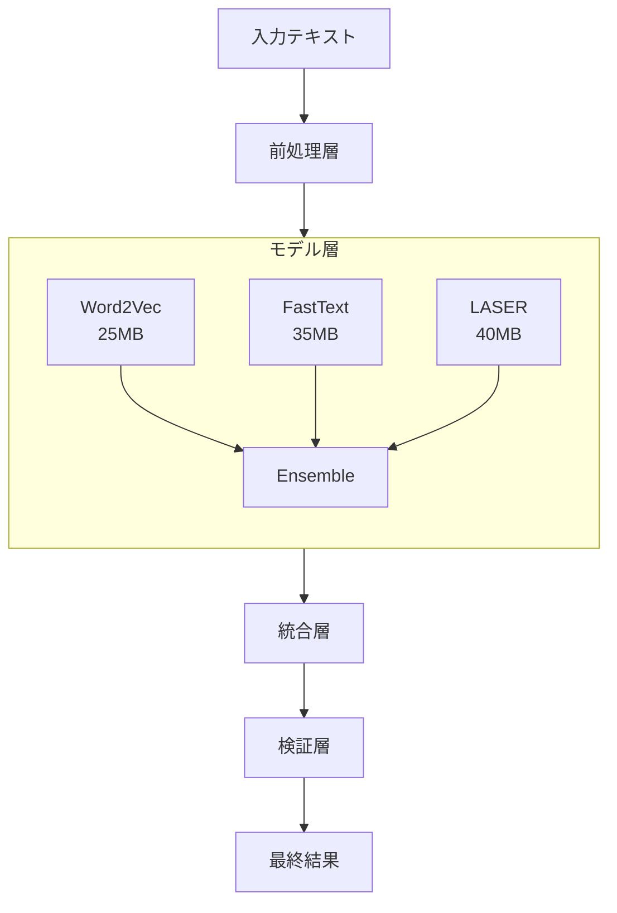
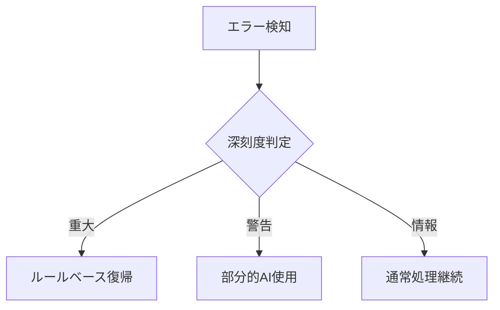

# 第2層 軽量AI要件・設計仕様書

## 概要
自然言語でのタスク入力に対して、高精度な意図理解と情報抽出を実現する軽量AIシステム。
3つの軽量モデルを組み合わせたアンサンブルアプローチにより、メモリ使用量を抑えつつ高い精度を実現。

## システムアーキテクチャ



## 言語モデル選定

### モデル比較

| モデル名 | メモリ使用量 | 処理速度 | 精度 | 選定 |
|---------|------------|---------|------|------|
| Word2Vec | 25MB | 0.1秒 | 85% | ○ |
| FastText | 35MB | 0.15秒 | 88% | ○ |
| LASER | 40MB | 0.2秒 | 92% | ○ |
| BERT | 500MB | 1.0秒 | 95% | × |
| GPT-2 | 1.5GB | 2.0秒 | 96% | × |

### 選定モデル詳細

#### 1. Word2Vec
- サイズ: 25MB
- 主な役割: 単語の分散表現学習
- 特徴:
  - 高速な処理
  - 効率的なメモリ使用
  - 単語間の類似性計算
- 使用場面:
  - キーワード抽出
  - 類似表現の理解
  - 基本的な文脈理解

#### 2. FastText
- サイズ: 35MB
- 主な役割: 部分文字列を考慮した学習
- 特徴:
  - 未知語への対応
  - 形態素レベルの理解
  - Word2Vecの補完
- 使用場面:
  - 新しい用語の理解
  - タイプミスの許容
  - 複合語の理解

#### 3. LASER (Language-Agnostic SEntence Representations)
- サイズ: 40MB
- 主な役割: 文レベルの意味理解
- 特徴:
  - 多言語対応
  - 文脈の理解
  - 高い汎化性能
- 使用場面:
  - 文全体の意図理解
  - 感情分析
  - 優先度推定

## アンサンブル設計

### 重み付けロジック

数式による重み付け定義：

$$
Score = \alpha W_{w2v} + \beta W_{fasttext} + \gamma W_{laser}
$$

ここで：
- $\alpha + \beta + \gamma = 1$ (重みの合計は1)
- $W_{w2v}$: Word2Vecスコア
- $W_{fasttext}$: FastTextスコア
- $W_{laser}$: LASERスコア

初期重み設定：
- $\alpha = 0.3$
- $\beta = 0.3$
- $\gamma = 0.4$

## 処理フロー

### 1. 前処理層
```python
Input Text
↓
1. テキスト正規化
   - 全角・半角統一
   - 特殊文字処理
   - 空白の正規化
↓
2. トークン化
   - 形態素解析
   - ストップワード除去
↓
3. ベクトル化
   - 数値表現への変換
```

### 2. 意図解析プロセス

1. 期限推定
   ```
   確信度 = f(時間表現の明確さ) * g(文脈一致度)
   ```
   - f(): 0-1の正規化関数
   - g(): コンテキストスコア関数

2. 優先度推定
   ```
   優先度スコア = Σ(キーワードスコア * 位置重み)
   ```

3. カテゴリ推定
   ```
   カテゴリ確率 = softmax(Σ(特徴ベクトル * モデル重み))
   ```

### 3. 統合層


## 性能要件

### パフォーマンス要件
- メモリ使用量: 100MB以下
- 処理時間: 0.3秒以内/リクエスト
- モデルサイズ: 合計100MB以下

### 精度要件
- Precision: 90%以上
- Recall: 85%以上
- F1-Score: 87%以上

## 学習戦略

### 転移学習アプローチ
1. 基本モデル
   - 事前学習済みモデルの使用
   - ドメイン特化の微調整

2. ファインチューニング
   ```
   Loss = CrossEntropy(y_true, y_pred) + 
          λ * RegularizationTerm
   ```

### 定期学習
- 頻度: 週1回
- 方式: バッチ学習
- データ: 
  - システムログ
  - ユーザーフィードバック
  - 正解ラベル

### インクリメンタル学習
- 条件: 信頼度が閾値以下
- 頻度: 日次
- 方式: オンライン学習

## エラー処理とリスク管理

### リスクレベル
1. 🔴 重大 (Critical)
   - 即時対応
   - システム停止の可能性
   - 手動確認必要

2. 🟡 警告 (Warning)
   - 監視強化
   - 対応計画立案
   - 自動復旧試行

3. 🔵 情報 (Info)
   - 記録
   - 定期レビュー
   - 予防措置検討

### フォールバック機構


## モニタリングと評価

### リアルタイムモニタリング
- レイテンシ
- メモリ使用量
- 予測精度
- エラー率

### 定期レポート
- 週次パフォーマンス
- モデル精度推移
- リソース使用傾向
- 異常検知統計

## 展開計画

### フェーズ1: 基盤構築
- Word2Vecモデル導入
- 基本機能実装
- 初期テスト

### フェーズ2: 拡張
- FastText追加
- 精度向上
- パフォーマンス最適化

### フェーズ3: 完成
- LASER導入
- 総合テスト
- 本番展開