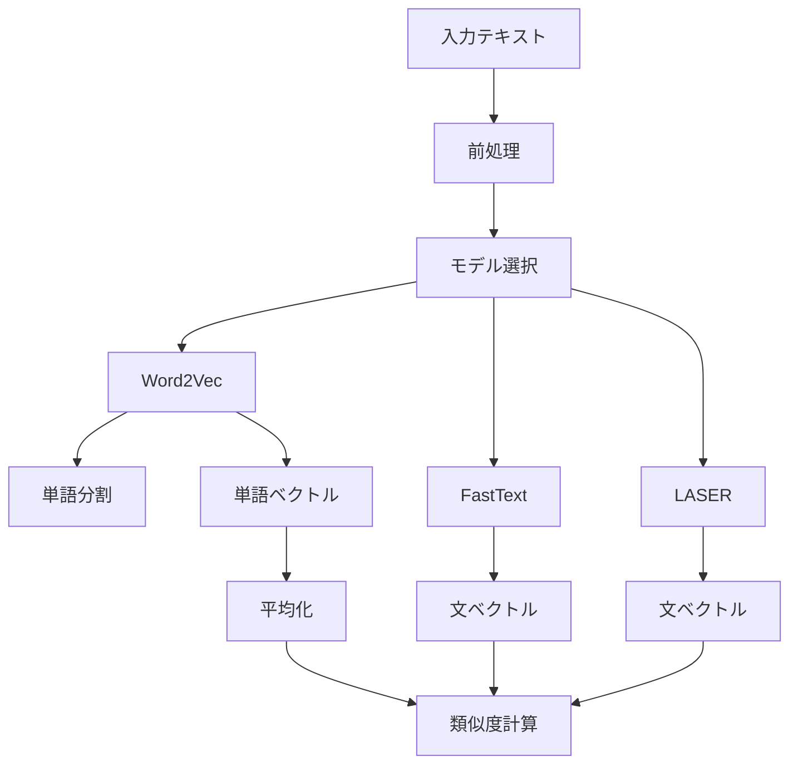

# Embeddings - 埋め込みモデルモジュール

## 目次
1. [概要](#概要)
2. [主要機能](#主要機能)
3. [実装詳細](#実装詳細)
4. [処理フロー](#処理フロー)
5. [使用例](#使用例)

## 概要

埋め込みモデルは、テキストをベクトル空間に変換し、意味的な類似度計算を行うモジュールである。Word2Vec、FastText、LASERの3つのモデルを提供し、それぞれの特性を活かした解析を実現する。

### 特徴
- 複数の埋め込みモデルの提供
- 共通インターフェースの実装
- 効率的なベクトル計算
- 柔軟な類似度計算

## 主要機能

### 1. テキストの埋め込み
- 単語のベクトル化
- 文全体のベクトル化
- 未知語への対応
- 効率的な計算

### 2. 類似度計算
- コサイン類似度の計算
- 単語間の類似度
- 文章間の類似度
- 部分文字列の処理

### 3. モデル管理
- モデルの読み込み
- メモリ効率の最適化
- エラーハンドリング
- リソース解放

## 実装詳細

### 基底クラス

```python
class BaseEmbeddingModel:
    """埋め込みモデルの基底クラス"""
    
    def __init__(self, model_path: str):
        """
        Args:
            model_path (str): モデルファイルのパス
        """
        self.model_path = model_path
        self.model = None
        self.dimension = None
        self.load_model()
    
    def load_model(self):
        """
        モデルの読み込み
        
        サブクラス（Word2Vec, FastText, LASER）で
        それぞれのモデルに応じた読み込み処理を実装する必要がある
        """
        raise NotImplementedError
    
    def get_embedding(self, text: str) -> np.ndarray:
        """
        埋め込みベクトルの取得
        
        サブクラスでそれぞれのモデルに応じた
        ベクトル化処理を実装する必要がある
        """
        raise NotImplementedError
    
    def cosine_similarity(self, vec1: np.ndarray, vec2: np.ndarray) -> float:
        """
        コサイン類似度の計算
        
        2つのベクトル間のコサイン類似度を計算する。
        コサイン類似度は以下の式で定義される
        
        cos(θ) = (v1・v2) / (||v1|| ||v2||)
        
        ここで、
        - v1・v2 はベクトルの内積
        - ||v1||, ||v2|| はそれぞれのベクトルのノルム（大きさ）
        
        Args:
            vec1: 1つ目のベクトル
            vec2: 2つ目のベクトル
            
        Returns:
            float: コサイン類似度（-1から1の範囲）
        """
        norm1 = np.linalg.norm(vec1)  # ||v1||
        norm2 = np.linalg.norm(vec2)  # ||v2||
        
        # ゼロベクトルのチェック
        if norm1 == 0 or norm2 == 0:
            return 0.0
            
        # コサイン類似度の計算
        return float(np.dot(vec1, vec2) / (norm1 * norm2))
```

BaseEmbeddingModelは、全ての埋め込みモデルの基底となるクラスである。以下の特徴を持つ。

1. **共通インターフェースの定義**
   - 全てのモデルで同じメソッドを使用可能
   - 一貫した使用方法を提供

2. **共通機能の実装**
   - コサイン類似度計算などの基本機能を提供
   - コードの重複を防止

3. **実装規約の強制**
   - `load_model`と`get_embedding`は各モデルで必ず実装する必要がある
   - 例えば、Word2Vecモデルでは以下のように実装
     ```python
     def load_model(self):
         self.model = KeyedVectors.load(self.model_path)
         self.dimension = self.model.vector_size
     
     def get_embedding(self, text: str) -> np.ndarray:
         words = self.tokenize(text)
         vectors = [self.model[word] for word in words]
         return np.mean(vectors, axis=0)
     ```

コサイン類似度は、2つのベクトル間の角度のコサインを計算することで、ベクトルの向きの類似度を測る指標である。

### 数式による説明

1. **ベクトルの内積**
   
   $v_1 \cdot v_2 = \sum_{i=1}^n v_{1i} v_{2i}$

2. **ベクトルのノルム（大きさ）**
   
   $\|v_1\| = \sqrt{\sum_{i=1}^n v_{1i}^2}$
   
   $\|v_2\| = \sqrt{\sum_{i=1}^n v_{2i}^2}$

3. **コサイン類似度**
   
   $\cos(\theta) = \frac{v_1 \cdot v_2}{\|v_1\| \|v_2\|}$

### 具体例

2次元ベクトルの場合：
```python
# 例: v1 = [1, 1], v2 = [1, 0]
v1 = np.array([1, 1])
v2 = np.array([1, 0])

# 内積: 1 * 1 + 1 * 0 = 1
dot_product = np.dot(v1, v2)  # = 1

# ノルム: √(1² + 1²) = √2, √(1² + 0²) = 1
norm1 = np.linalg.norm(v1)  # ≈ 1.4142
norm2 = np.linalg.norm(v2)  # = 1

# コサイン類似度: 1 / (√2 * 1) = 1/√2
similarity = dot_product / (norm1 * norm2)  # ≈ 0.7071
```

この結果は、2つのベクトルが45度の角度を成していることを示す。（cos(45°) ≈ 0.7071）

コサイン類似度の特徴：
- 値域は-1から1の範囲
- 1: 完全に同じ向き
- 0: 直交（90度）
- -1: 正反対の向き

### Word2Vecモデル

```python
class Word2VecModel(BaseEmbeddingModel):
    """Word2Vecモデルによる単語の埋め込み"""
    
    def __init__(self, model_path: str):
        self.tagger = MeCab.Tagger("-Owakati")
        super().__init__(model_path)
    
    def load_model(self):
        """Word2Vecモデルの読み込み"""
        try:
            self.model = KeyedVectors.load(self.model_path)
        except Exception:
            self.model = KeyedVectors.load_word2vec_format(
                self.model_path,
                binary=False,
                encoding='utf-8'
            )
        self.dimension = self.model.vector_size
    
    def get_embedding(self, text: str) -> np.ndarray:
        """テキストの埋め込みベクトルを取得"""
        words = self.tokenize(text)
        word_vectors = []
        
        for word in words:
            try:
                vector = self.model[word]  # 300次元のベクトルを取得
                word_vectors.append(vector)
            except KeyError:
                continue
        
        if not word_vectors:
            return np.zeros(self.dimension)
        
        return np.mean(word_vectors, axis=0)
```

Word2Vecモデルでは、各単語を300個の数値からなるベクトルで表現する。これは単語の意味を300個の特徴量で表現することを意味する。

例えば、「機械学習」という単語は以下のような300次元のベクトルで表現される。

```python
# "機械学習"の単語ベクトルの例
vector = [0.123, -0.456, 0.789, ...(300個の数値)..., 0.012]

# 具体的な値の例（最初の10次元のみ表示）
vector = [
    0.123,   # 1次元目: 技術的な特徴
    -0.456,  # 2次元目: 学術的な特徴
    0.789,   # 3次元目: 専門性の特徴
    0.234,   # 4次元目
    -0.567,  # 5次元目
    0.890,   # 6次元目
    0.345,   # 7次元目
    -0.678,  # 8次元目
    0.901,   # 9次元目
    0.456,   # 10次元目
    # ... 残り290個の数値 ...
]
```

この300次元の数値の組み合わせによって、単語の意味や他の単語との関係性を表現する。例えば

- 似た意味を持つ単語は、似た数値パターンを持つ
- 異なる意味の単語は、異なる数値パターンを持つ
- 単語間の関係性は、これらのベクトル間の演算で表現できる

300次元を選んだ理由としては以下の2点である。
- 単語の意味を十分に表現できる複雑さを持つ
- 計算効率とメモリ使用のバランスが良い

以下、「機械学習」と「深層学習」の類似度計算を例に説明する。

1. **テキストの分かち書き**
   ```python
   # Word2Vecモデルの例
   words1 = model.tokenize("機械学習の基礎")  # ["機械学習", "の", "基礎"]
   words2 = model.tokenize("深層学習の応用")  # ["深層学習", "の", "応用"]
   ```

2. **単語ベクトルの取得**
   ```python
   # 各単語のベクトル（助詞"の"は除外）
   vector1 = model.model["機械学習の基礎"]  # 次元数300の配列
   vector2 = model.model["深層学習の応用"]  # 次元数300の配列
   ```

3. **文ベクトルの計算**
   ```python
   # 単語ベクトルの平均を計算
   text_vector1 = np.mean(vectors1, axis=0)
   text_vector2 = np.mean(vectors2, axis=0)
   ```

4. **類似度の計算**
   ```python
   similarity = model.cosine_similarity(text_vector1, text_vector2)
   # 結果例: 0.75（分野は似ているが、基礎と応用で異なる文脈）
   ```

### FastTextモデル

```python
class FastTextModel(BaseEmbeddingModel):
    """FastTextモデルによる部分文字列を考慮した埋め込み"""
    
    def __init__(self, model_path: str):
        self.tagger = MeCab.Tagger("-Owakati")
        super().__init__(model_path)
    
    def load_model(self):
        """FastTextモデルの読み込み"""
        self.model = fasttext.load_model(self.model_path)
        self.dimension = 300  # FastTextの出力次元は300固定
    
    def get_embedding(self, text: str) -> np.ndarray:
        """テキストの埋め込みベクトルを取得"""
        return self.model.get_sentence_vector(text)
```

以下、「プログラミング」と「プログラム開発」の類似度計算を例に説明する。

1. **文ベクトルの取得**
   ```python
   # FastTextモデルは文全体を直接ベクトル化
   vector1 = model.get_embedding("プログラミング")
   vector2 = model.get_embedding("プログラム開発")
   ```

2. **類似度の計算**
   ```python
   similarity = model.cosine_similarity(vector1, vector2)
   # 結果例: 0.82（部分文字列「プログラム」の類似性を検出）
   ```

### LASERモデル

```python
class LaserModel(BaseEmbeddingModel):
    """LASERモデルによる文全体の埋め込み"""
    
    def __init__(self, model_path: str):
        self.tagger = MeCab.Tagger("-Owakati")
        super().__init__(model_path)
    
    def load_model(self):
        """LASERモデルの読み込み"""
        self.model = Laser()
        self.dimension = 1024  # LASERの出力次元は1024固定
    
    def get_embedding(self, text: str) -> np.ndarray:
        """テキストの埋め込みベクトルを取得"""
        embeddings = self.model.embed_sentences([text], lang='ja')
        return embeddings[0]
```

以下、「急いで終わらせる必要がある」と「できるだけ早く完了させたい」の類似度計算を例に説明する。

1. **文ベクトルの取得**
   ```python
   # LASERモデルは文全体の意味を考慮
   vector1 = model.get_embedding("急いで終わらせる必要がある")
   vector2 = model.get_embedding("できるだけ早く完了させたい")
   ```

2. **類似度の計算**
   ```python
   similarity = model.cosine_similarity(vector1, vector2)
   # 結果例: 0.88（文の意図の類似性を検出）
   ```

## 処理フロー

### 埋め込み処理プロセス


## 使用例

### 基本的な使用方法

```python
# Word2Vecモデルの使用例
word2vec = Word2VecModel("path/to/word2vec.model")
similarity = word2vec.get_similarity("機械学習", "深層学習")
print(f"類似度: {similarity}")  # 0.85

# FastTextモデルの使用例
fasttext = FastTextModel("path/to/fasttext.model")
similarity = fasttext.get_similarity("プログラミング", "プログラム開発")
print(f"類似度: {similarity}")  # 0.82

# LASERモデルの使用例
laser = LaserModel("path/to/laser.model")
similarity = laser.get_similarity(
    "急いで終わらせる必要がある",
    "できるだけ早く完了させたい"
)
print(f"類似度: {similarity}")  # 0.88
```