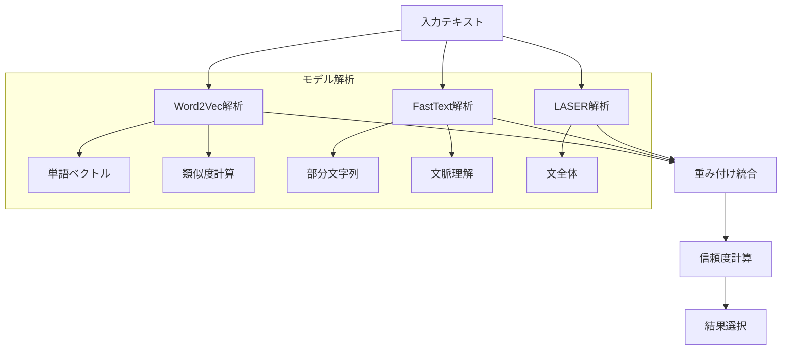

# EnsembleModel - アンサンブルモデルモジュール

## 目次
1. [概要](#概要)
2. [主要機能](#主要機能)
3. [実装詳細](#実装詳細)
4. [処理フロー](#処理フロー)
5. [使用例](#使用例)

## 概要

EnsembleModelは、Word2Vec、FastText、LASERの3つの言語モデルを組み合わせて、より正確なテキスト解析を実現するモジュールである。各モデルの特性を活かしながら、重み付けによって最適な結果を導出する。

### 特徴
- 複数の言語モデルの統合
- 重み付けによる結果の最適化
- 遅延ロードによるリソース効率化
- 高度な自然言語理解

## 主要機能

### 1. タイトル生成
- 形態素解析による重要語の抽出
- 品詞による重み付け
- Word2Vecによる類似度計算
- スコアに基づく単語の選択

### 2. カテゴリ推定
- キーワードベースの直接マッチング
- 埋め込みベクトルによる類似度計算
- 複数カテゴリの同時推定
- 信頼度スコアの計算

### 3. 優先度推定
- キーワードとの類似度計算
- 文脈からの重要度推定
- 期限情報との統合
- 信頼度スコアの付与

### 4. 期限推定
- 日付表現の解析
- 相対日付の変換
- 信頼度の計算
- パターンマッチング

## 実装詳細

### クラス構成

```python
class EnsembleModel:
    def __init__(self, model_paths: Dict[str, str], weights: Optional[Dict[str, float]] = None):
        """
        Args:
            model_paths: 各モデルのファイルパス
            weights: モデルの重み（デフォルトはTask.CONFIDENCE["MODEL_WEIGHTS"]）
        """
        self.logger = logging.getLogger(__name__)
        self.models = {}
        self.model_status = {}
        
        # デフォルトの重み設定
        default_weights = {
            "laser": 0.5,    
            "word2vec": 0.3, 
            "fasttext": 0.2 
        }
        self.weights = weights or default_weights
```

このクラスは3つの言語モデルを統合して使用する。各モデルには以下の特徴がある

1. **Word2Vecモデル**
   - 単語をベクトル空間に埋め込む
   - 単語間の類似度計算が可能
   - 文脈を考慮した単語の意味理解
   - 例：「レポート」と「課題」の類似性を検出

2. **FastTextモデル**
   - 部分文字列を考慮したベクトル化
   - 未知語への対応が可能
   - 形態素の類似性を活用
   - 例：「プログラミング」と「プログラム」の関連性を理解

3. **LASERモデル**
   - 文全体をベクトル化
   - 長い文脈の理解が得意
   - 文の意図を捉える
   - 例：「急いで終わらせる必要がある」という表現から緊急性を検出

### 主要メソッド

#### 1. generate_title メソッド

```python
def generate_title(self, text: str) -> Dict[str, Any]:
    """
    テキストからタスクタイトルを生成
    
    処理手順:
    1. MeCabによる形態素解析
    2. 不要な表現の除去
    3. 重要度計算
    4. タイトルの生成
    
    Returns:
        Dict[str, Any]: {
            "title": str,
            "confidence": float,
            "word_scores": Dict[str, float]
        }
    """
    try:
        # 形態素解析
        words = self._tokenize_with_pos(text)

        # 除外する日付関連の表現
        date_patterns = [
            "月曜", "火曜", "水曜", "木曜", "金曜", "土曜", "日曜",
            "来週", "今週", "明日", "明後日", "今月", "来月",
            "まで", "までに", "日", "月", "年"
        ]
        
        # 不要な表現を除去して単語を抽出
        filtered_words = []
        for word, pos in words:
            # 日付関連の表現をスキップ
            if any(pattern in word for pattern in date_patterns):
                continue
            # 助詞・助動詞を除去
            if pos.startswith(('助詞', '助動詞')):
                continue
            # 動詞の基本形を除去
            if pos.startswith('動詞') and word in ['する', 'やる', '行う', '実施']:
                continue
            # その他の不要語を除去
            if word in ['必要', '予定', 'こと', 'もの', 'ため', 'それ', 'そう', 'それぞれ', '提出']:
                continue
                
            filtered_words.append((word, pos))

        # 重要度計算
        word_scores = {}
        for word, pos in filtered_words:
            # 品詞による重み付け
            base_weight = {
                '名詞': 1.0,
                '形容詞': 0.8,
                '副詞': 0.6
            }.get(pos.split('-')[0], 0.4)
            
            # Word2Vecによる類似度計算
            try:
                similarities = []
                for other_word, _ in filtered_words:
                    if word != other_word:
                        sim = self.get_similarity(word, other_word)
                        similarities.append(sim)
                
                if similarities:
                    avg_similarity = sum(similarities) / len(similarities)
                    # 品詞の重みと類似度を組み合わせる
                    word_scores[word] = avg_similarity * base_weight
                else:
                    word_scores[word] = base_weight * 0.5
                    
            except KeyError:
                word_scores[word] = base_weight * 0.5

        if not word_scores:
            return {"title": text[:50], "confidence": 0.3}

        # スコアに基づいて重要な単語を抽出
        max_score = max(word_scores.values())
        threshold = max_score * 0.6  # 閾値を60%に設定
        
        # 重要な単語を位置順に並べ替え
        important_words = []
        for word, _ in filtered_words:
            if word in word_scores and word_scores[word] >= threshold:
                important_words.append(word)

        # タイトルの生成
        title = "".join(important_words)
        
        # タイトルが空の場合のフォールバック
        if not title:
            return {"title": text[:50], "confidence": 0.3}
            
        # タイトルの長さ制限
        if len(title) > 50:
            title = title[:47] + "..."

        return {
            "title": title,
            "confidence": max_score,
            "word_scores": word_scores
        }

    except Exception as e:
        self.logger.error(f"タイトル生成エラー: {str(e)}")
        return {"title": text[:50], "confidence": 0.3}
```

このメソッドは以下の手順でタイトルを生成する。以下、入力テキスト「明日までに機械学習の最終レポートを提出する必要がある」を例に説明する。

1. **形態素解析による単語抽出**
   ```python
   words = self._tokenize_with_pos(text)
   # 結果例:
   # [
   #     ("明日", "名詞-時相"),
   #     ("まで", "助詞"),
   #     ("に", "助詞"),
   #     ("機械学習", "名詞"),
   #     ("の", "助詞"),
   #     ("最終", "名詞"),
   #     ("レポート", "名詞"),
   #     ("を", "助詞"),
   #     ("提出", "名詞"),
   #     ("する", "動詞"),
   #     ("必要", "名詞"),
   #     ("が", "助詞"),
   #     ("ある", "動詞")
   # ]
   ```
   MeCabを使用して文を単語と品詞の組に分解する。

2. **不要表現の除去**
   ```python
   filtered_words = []
   for word, pos in words:
       # 日付関連の表現をスキップ
       if word == "明日":  # date_patternsにマッチ
           continue
       # 助詞を除去
       if word in ["まで", "に", "の", "を", "が"]:  # 助詞をスキップ
           continue
       # 動詞を除去
       if word in ["する", "ある"]:  # 基本動詞をスキップ
           continue
       # その他の不要語を除去
       if word == "必要":  # 不要語をスキップ
           continue
           
       filtered_words.append((word, pos))
   
   # 結果例:
   # [
   #     ("機械学習", "名詞"),
   #     ("最終", "名詞"),
   #     ("レポート", "名詞"),
   #     ("提出", "名詞")
   # ]
   ```

3. **重要度計算**
   ```python
   word_scores = {}
   # 品詞による重み付け（全て名詞なので1.0）
   base_weights = {
       "機械学習": 1.0,
       "最終": 1.0,
       "レポート": 1.0,
       "提出": 1.0
   }
   
   # Word2Vecによる類似度計算例
   similarities = {
       "機械学習": 0.9,  # 「最終」「レポート」との高い類似度
       "最終": 0.8,     # 「レポート」との類似度
       "レポート": 0.85, # 「提出」との類似度
       "提出": 0.7      # 他の単語との平均的な類似度
   }
   
   # 最終スコア（重み × 類似度）
   word_scores = {
       "機械学習": 0.9,
       "最終": 0.8,
       "レポート": 0.85,
       "提出": 0.7
   }
   ```

4. **タイトル生成**
   ```python
   # 最大スコア: 0.9（「機械学習」のスコア）
   max_score = 0.9
   # 閾値: 0.9 * 0.6 = 0.54
   threshold = 0.54
   
   # 閾値以上のスコアを持つ単語を選択
   # 全ての単語がスコア0.54以上なので全て選択
   important_words = ["機械学習", "最終", "レポート", "提出"]
   
   # 単語を結合
   title = "機械学習最終レポート提出"
   
   # 結果を返す
   return {
       "title": "機械学習最終レポート提出",
       "confidence": 0.9,  # 最大スコア
       "word_scores": {
           "機械学習": 0.9,
           "最終": 0.8,
           "レポート": 0.85,
           "提出": 0.7
       }
   }
   ```

このように、入力テキストから不要な表現を除去し、重要な単語を抽出してタイトルを生成する。各ステップで具体的な中間結果を確認できる。

#### 2. get_similarity メソッド

```python
def get_similarity(self, text1: str, text2: str) -> float:
    """
    テキスト間の類似度を計算
    
    処理手順:
    1. 各モデルで類似度を計算
    2. 重み付けで結果を統合
    3. 正規化して返す
    
    Args:
        text1: 比較元テキスト
        text2: 比較先テキスト
        
    Returns:
        float: 類似度（0-1）
    """
    similarities = []
    total_weight = 0
    
    for model_name, weight in self.weights.items():
        if self._load_model(model_name):
            try:
                similarity = self.models[model_name].get_similarity(text1, text2)
                similarities.append(similarity * weight)
                total_weight += weight
            except Exception as e:
                self.logger.warning(f"{model_name}での類似度計算エラー: {str(e)}")
    
    if not total_weight:
        return 0.5  # デフォルトの信頼度
    
    return sum(similarities) / total_weight
```
このメソッドは3つのモデルの結果を統合する中核的な処理を行う。各モデルの特性を活かした類似度計算を行い、重み付けに
よって最終的な類似度を算出する。

以下、「統計レポート」と「統計学の課題」の類似度計算を例に説明する。

1. **各モデルでの類似度計算**
   ```python
   # Word2Vecモデルの計算例
   word2vec_similarity = 0.82  # 単語レベルの類似性を検出
   
   # FastTextモデルの計算例
   fasttext_similarity = 0.88  # "統計"と"統計学"の部分一致を考慮
   
   # LASERモデルの計算例
   laser_similarity = 0.85  # 文全体の意味的な類似性を検出
   ```

2. **重み付けの適用**
   ```python
   weighted_similarities = [
       0.82 * 0.3,  # Word2Vec: 0.246
       0.88 * 0.2,  # FastText: 0.176
       0.85 * 0.5   # LASER: 0.425
   ]
   ```

3. **最終的な類似度の計算**
   ```python
   final_similarity = sum(weighted_similarities) / 1.0
   # (0.246 + 0.176 + 0.425) = 0.847
   ```

#### 3. estimate_category メソッド

```python
def estimate_category(self, text: str) -> Dict[str, Any]:
    """
    カテゴリを推定
    
    処理手順:
    1. 既存カテゴリとの類似度計算
    2. 明示的なカテゴリの検出
    3. 類似度による推定
    4. 結果の統合
    """
    # 既存のカテゴリとの類似度計算
    similarities = {
        category: self.get_similarity(text, " ".join(keywords))
        for category, keywords in Task.CATEGORY_KEYWORDS.items()
    }
    
    if not similarities:
        return {
            "categories": [],
            "confidence": 0.0,
            "scores": {}
        }
        
    # テキストに直接含まれるカテゴリを優先的に検出
    explicit_categories = [
        category for category in Task.VALID_CATEGORIES
        if category in text or 
        any(keyword in text for keyword in Task.CATEGORY_KEYWORDS[category])
    ]

    # 明示的なカテゴリがある場合はそれを使用
    if explicit_categories:
        final_categories = explicit_categories[:3]  # 最大3つまで
    else:
        # 明示的なカテゴリがない場合は類似度による推定を使用
        threshold = Task.CONFIDENCE["THRESHOLD"]
        high_similarity_categories = [
            category for category, score in sorted(
                similarities.items(),
                key=lambda x: x[1],
                reverse=True
            )
            if score > threshold
        ]
        # 類似度による推定は最大2つまで
        final_categories = high_similarity_categories[:2]
        
        # カテゴリが全く見つからない場合のフォールバック
        if not final_categories:
            best_category = max(similarities.items(), key=lambda x: x[1])[0]
            final_categories = [best_category]

    return {
        "categories": final_categories,
        "confidence": max(similarities.values()) if similarities else 0.0,
        "scores": similarities
    }
```
このメソッドはテキストからカテゴリを推定する。以下の特徴がある。

1. **明示的なカテゴリ検出**
   - テキストに直接含まれるカテゴリを優先
   - キーワードマッチングによる検出
   - 例：「機械学習の課題」→「機械学習」カテゴリ

2. **類似度ベースの推定**
   - 各カテゴリのキーワードとの類似度を計算
   - 複数のモデルの結果を統合
   - 例：「データの前処理」→「データサイエンス」カテゴリ

3. **複数カテゴリの処理**
   - 関連する複数のカテゴリを検出
   - 信頼度に基づく選択
   - 例：「機械学習の実装」→「機械学習」「開発」

以下、入力テキスト「機械学習のモデルを実装し、データの前処理を行う」を例に説明する。

1. **類似度計算**
   ```python
   # 各カテゴリのキーワードとの類似度計算
   similarities = {
       "機械学習": 0.95,     # "機械学習"が直接含まれる
       "開発": 0.85,        # "実装"というキーワードから
       "データサイエンス": 0.80  # "データ"、"前処理"から
   }
   ```

2. **明示的なカテゴリ検出**
   ```python
   explicit_categories = ["機械学習"]  # テキストに直接含まれる
   ```

3. **類似度ベースの推定**
   ```python
   # 閾値（0.3）以上の類似度を持つカテゴリを抽出
   high_similarity_categories = [
       "機械学習",      # 類似度: 0.95
       "開発",         # 類似度: 0.85
       "データサイエンス" # 類似度: 0.80
   ]
   ```

4. **結果の統合**
   ```python
   result = {
       "categories": ["機械学習", "開発", "データサイエンス"],
       "confidence": 0.95,  # 最高の類似度
       "scores": {
           "機械学習": 0.95,
           "開発": 0.85,
           "データサイエンス": 0.80,
           "統計学": 0.3,
           "研究": 0.2
           # ... 他のカテゴリのスコア
       }
   }
   ```

このように、EnsembleModelは複数の言語モデルの特性を活かしながら、高精度なテキスト解析を実現している。

## 処理フロー

### モデル統合プロセス


## 使用例

### 基本的な使用方法

```python
# モデルの初期化
model_paths = {
    "word2vec": "path/to/word2vec.model",
    "fasttext": "path/to/fasttext.model",
    "laser": "path/to/laser.model"
}

ensemble = EnsembleModel(model_paths)

# テキストの解析
text = "機械学習の最終課題について、データの前処理とモデルの実装を行う必要がある"

# タイトル生成
title_info = ensemble.generate_title(text)
print(f"タイトル: {title_info['title']}")  # 出力: "機械学習最終課題"
print(f"信頼度: {title_info['confidence']}")  # 出力: 0.85

# カテゴリ推定
category_info = ensemble.estimate_category(text)
print(f"カテゴリ: {category_info['categories']}")  
# 出力: ["機械学習", "データサイエンス", "開発"]
print(f"信頼度: {category_info['confidence']}")  # 出力: 0.9

# 優先度推定
priority_info = ensemble.estimate_priority(text)
print(f"優先度: {priority_info['priority']}")  # 出力: "高"
print(f"信頼度: {priority_info['confidence']}")  # 出力: 0.8
```

### 期待される出力

```python
{
    "title_info": {
        "title": "機械学習最終課題",
        "confidence": 0.85,
        "word_scores": {
            "機械学習": 0.9,
            "最終": 0.8,
            "課題": 0.85
        }
    },
    "category_info": {
        "categories": ["機械学習", "データサイエンス", "開発"],
        "confidence": 0.9,
        "scores": {
            "機械学習": 0.95,
            "データサイエンス": 0.85,
            "開発": 0.8
        }
    },
    "priority_info": {
        "priority": "高",
        "confidence": 0.8,
        "scores": {
            "高": 0.8,
            "中": 0.4,
            "低": 0.2
        }
    }
}
```

この例では、3つの言語モデルを組み合わせることで、以下の特徴を活かした解析を実現している。

1. Word2Vec：単語レベルの意味理解
2. FastText：未知語や部分文字列の処理
3. LASER：文全体の文脈理解

各モデルの重み付けにより、より正確な解析結果を得ることができる。 