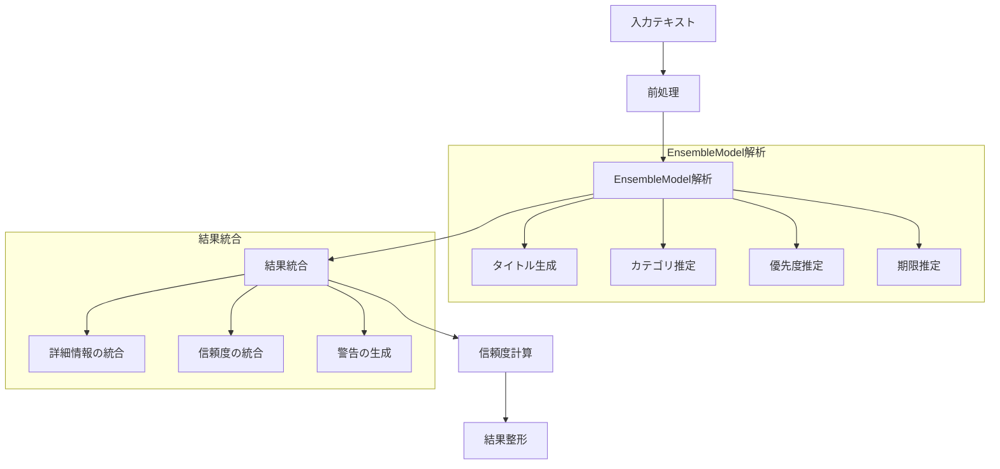

# AIInference - AI推論モジュール

## 目次
1. [概要](#概要)
2. [主要機能](#主要機能)
3. [実装詳細](#実装詳細)
4. [処理フロー](#処理フロー)
5. [使用例](#使用例)

## 概要

AIInferenceは、EnsembleModelを使用してテキスト解析を行うインターフェースを提供するモジュールである。複数の言語モデルを統合し、タイトル生成、カテゴリ推定、優先度判定などの解析機能を提供する。

### 特徴
- EnsembleModelのラッパーとして機能
- 詳細な解析結果の提供
- エラーハンドリングの実装
- ログ機能の統合

## 主要機能

### 1. テキスト分析
- タイトルの自動生成
- カテゴリの推定
- 優先度の判定
- 期限の推定

### 2. 信頼度評価
- 各推定結果の信頼度計算
- 総合的な信頼度スコアの提供
- 詳細な分析結果の提供

### 3. エラー処理
- モデル初期化エラーの処理
- 解析エラーのハンドリング
- フォールバック値の提供

## 実装詳細

### クラス構成

```python
class AIInference:
    def __init__(self, model_paths: Dict[str, str], weights: Optional[Dict[str, float]] = None):
        """
        Args:
            model_paths: モデルファイルパス
            weights: モデルの重み
        """
        self.logger = logging.getLogger(__name__)
        self.logger.setLevel(logging.INFO)
        
        try:
            self.ensemble = EnsembleModel(model_paths, weights)
            self.logger.info("AIInference初期化完了")
        except Exception as e:
            self.logger.error(f"AIInference初期化エラー: {str(e)}")
            raise
```

AIInferenceクラスは、EnsembleModelを使用してテキスト解析を行うためのインターフェースを提供する。以下の特徴を持つ

1. **初期化パラメータ**
   ```python
   # モデルパス
   model_paths = {
       "word2vec": "/models/word2vec/japanese.model",
       "fasttext": "/models/fasttext/japanese.bin",
       "laser": "/models/laser/japanese.pt"
   }
   
   # 重み
   weights = {
       "word2vec": 0.3,  # 単語の意味理解
       "fasttext": 0.2,  # 未知語処理に補助的に使用
       "laser": 0.5      # 文全体の理解に重点
   }
   ```

2. **EnsembleModelの初期化**
   ```python
   try:
       # EnsembleModelのインスタンス化
       self.ensemble = EnsembleModel(model_paths, weights)
       
   except FileNotFoundError as e:
       # モデルファイルが見つからない場合
       self.logger.error(f"モデルファイルが見つかりません: {str(e)}")
       raise
       
   except ValueError as e:
       # 無効な重みが指定された場合
       self.logger.error(f"無効な重み設定です: {str(e)}")
       raise
       
   except Exception as e:
       # その他の初期化エラー
       self.logger.error(f"初期化エラー: {str(e)}")
       raise
   ```

3. **主要コンポーネント**
   - `self.ensemble`: テキスト解析の実行エンジン
   - `self.model_paths`: 学習済みモデルのファイルパス
   - `self.weights`: モデルの重み設定

4. **エラーハンドリング**
   ```python
   # 初期化エラーの例
   try:
       ai_inference = AIInference(
           model_paths={"word2vec": "invalid/path.model"},
           weights={"word2vec": 2.0}  # 無効な重み
       )
   except ValueError as e:
       print(f"重みは0-1の範囲で指定してください: {str(e)}")
   except FileNotFoundError as e:
       print(f"モデルファイルが見つかりません: {str(e)}")
   ```

このように、AIInferenceクラスは以下の役割を担う

1. EnsembleModelの初期化と管理
2. 解析結果の整形と提供
3. エラーハンドリングの実装
4. 解析結果の整形と提供

### 主要メソッド

#### 1. analyze_text メソッド

```python
def analyze_text(self, text: str, detailed: bool = False) -> Dict[str, Any]:
    """
    テキストの総合的な分析を実行
    
    Args:
        text: 入力テキスト
        detailed: 詳細な結果を返すかどうか
        
    Returns:
        Dict[str, Any]: 分析結果
    """
    try:
        self.logger.info(f"\n=== テキスト分析開始 ===")
        self.logger.info(f"入力テキスト: {text}")

        # タイトル生成
        title_info = self.ensemble.generate_title(text)
        self.logger.info(f"タイトル生成結果: {title_info}")
        
        # カテゴリ推定
        category_info = self.ensemble.estimate_category(text)
        self.logger.info(f"カテゴリ推定結果: {category_info}")
        
        # 優先度推定
        priority_info = self.ensemble.estimate_priority(text)
        self.logger.info(f"優先度推定結果: {priority_info}")
        
        # 期限推定
        deadline_info = self.ensemble.estimate_deadline(text)
        self.logger.info(f"期限推定結果: {deadline_info}")
        
        # 総合結果の構築
        confidence = self._calculate_confidence([
            title_info["confidence"],
            category_info["confidence"],
            priority_info["confidence"],
            deadline_info.get("confidence", 0)
        ])
        
        result = {
            "title": title_info["title"],
            "categories": category_info["categories"],
            "priority": priority_info["priority"],
            "deadline": deadline_info.get("deadline"),
            "confidence": confidence
        }
        
        if detailed:
            result["details"] = {
                "title": title_info,
                "category": category_info,
                "priority": priority_info,
                "deadline": deadline_info
            }
            
        self.logger.info(f"分析結果: {result}")
        return result
        
    except Exception as e:
        self.logger.error(f"テキスト分析エラー: {str(e)}")
        return self._get_fallback_result()
```

以下、入力テキスト「明日までに機械学習のレポートを提出する必要がある」を例に、各ステップでの処理を説明する。

1. **前処理とログ出力**
   ```python
   self.logger.info("\n=== テキスト分析開始 ===")
   self.logger.info("入力テキスト: 明日までに機械学習のレポートを提出する必要がある")
   ```

2. **タイトル生成**
   ```python
   title_info = self.ensemble.generate_title(text)
   # 結果例:
   {
       "title": "機械学習レポート提出",
       "confidence": 0.85,
       "word_scores": {
           "機械学習": 0.9,
           "レポート": 0.85,
           "提出": 0.8
       }
   }
   ```

3. **カテゴリ推定**
   ```python
   category_info = self.ensemble.estimate_category(text)
   # 結果例:
   {
       "categories": ["機械学習", "提出物"],
       "confidence": 0.9,
       "scores": {
           "機械学習": 0.95,
           "提出物": 0.85,
           "データサイエンス": 0.7
       }
   }
   ```

4. **優先度推定**
   ```python
   priority_info = self.ensemble.estimate_priority(text)
   # 結果例:
   {
       "priority": "高",  # 期限が明日のため
       "confidence": 0.9,
       "scores": {
           "高": 0.9,
           "中": 0.3,
           "低": 0.1
       }
   }
   ```

5. **期限推定**
   ```python
   deadline_info = self.ensemble.estimate_deadline(text)
   # 結果例:
   {
       "deadline": "2024-11-18",  # 明日の日付(2024-11-17現在)
       "confidence": 1.0,
       "matched_pattern": "明日",
       "days": 1
   }
   ```

6. **信頼度計算**
   ```python
   # 各信頼度の平均を計算
   confidence_scores = [
       0.85,  # タイトル生成の信頼度
       0.9,   # カテゴリ推定の信頼度
       0.9,   # 優先度推定の信頼度
       1.0    # 期限推定の信頼度
   ]
   
   confidence = sum(confidence_scores) / len(confidence_scores)
   # 結果: 0.9125
   ```

7. **最終結果の構築**
   ```python
   result = {
       "title": "機械学習レポート提出",
       "categories": ["機械学習", "提出物"],
       "priority": "高",
       "deadline": "2024-11-18",
       "confidence": 0.91,
       "details": {
           "title": {
               "title": "機械学習レポート提出",
               "confidence": 0.85,
               "word_scores": {
                   "機械学習": 0.9,
                   "レポート": 0.85,
                   "提出": 0.8
               }
           },
           "category": {
               "categories": ["機械学習", "提出物"],
               "confidence": 0.9,
               "scores": {
                   "機械学習": 0.95,
                   "提出物": 0.85,
                   "データサイエンス": 0.7
               }
           },
           "priority": {
               "priority": "高",
               "confidence": 0.9,
               "scores": {
                   "高": 0.9,
                   "中": 0.3,
                   "低": 0.1
               }
           },
           "deadline": {
               "deadline": "2024-11-18",
               "confidence": 1.0,
               "matched_pattern": "明日",
               "days": 1
           }
       }
   }
   ```

#### 2. _calculate_confidence メソッド

```python
def _calculate_confidence(self, scores: list) -> float:
    """
    信頼度スコアの計算
    
    Args:
        scores: 各分析結果の信頼度リスト
        
    Returns:
        float: 総合信頼度（0-1）
    """
    return round(sum(scores) / len(scores), 3)
```

#### 3. _get_fallback_result メソッド

```python
def _get_fallback_result(self) -> Dict[str, Any]:
    """
    エラー時のフォールバック結果
    
    Returns:
        Dict[str, Any]: デフォルトの結果
    """
    return {
        "title": "",
        "categories": [],
        "priority": "中",
        "deadline": None,
        "confidence": 0.0,
        "error": True
    }
```

## 処理フロー

### 分析プロセス


## 使用例

### 基本的な使用方法

```python
# モデルパスの設定
model_paths = {
    "word2vec": "path/to/word2vec.model",
    "fasttext": "path/to/fasttext.model",
    "laser": "path/to/laser.model"
}

# AIInferenceの初期化
ai_inference = AIInference(model_paths)

# テキストの分析
text = "明日までに機械学習のレポートを提出する必要がある"
result = ai_inference.analyze_text(text, detailed=True)

# 結果の出力
print(f"タイトル: {result['title']}")  # 機械学習レポート提出
print(f"カテゴリ: {result['categories']}")  # ['機械学習', '提出物']
print(f"優先度: {result['priority']}")  # 高
print(f"期限: {result['deadline']}")  # 2024-03-21
print(f"信頼度: {result['confidence']}")  # 0.91

# 詳細情報の確認
if result.get("details"):
    print("\n詳細情報:")
    print(f"タイトル生成の信頼度: {result['details']['title']['confidence']}")  # 0.85
    print(f"カテゴリ推定の信頼度: {result['details']['category']['confidence']}")  # 0.9
    print(f"優先度判定の信頼度: {result['details']['priority']['confidence']}")  # 0.9
    print(f"期限推定の信頼度: {result['details']['deadline']['confidence']}")  # 1.0
```

### エラーハンドリング例

```python
try:
    # 無効なモデルパスでの初期化
    invalid_paths = {
        "word2vec": "invalid/path/word2vec.model",
        "fasttext": "invalid/path/fasttext.model",
        "laser": "invalid/path/laser.model"
    }
    
    ai_inference = AIInference(invalid_paths)
    
except Exception as e:
    print(f"初期化エラー: {str(e)}")
    # 期待されるエラーメッセージ:
    # "モデルファイルが見つかりません"

# 空のテキストでの解析
try:
    result = ai_inference.analyze_text("")
    # フォールバック値が返される:
    # {
    #     "title": "",
    #     "categories": [],
    #     "priority": "中",
    #     "deadline": None,
    #     "confidence": 0.0,
    #     "error": True
    # }
    
except Exception as e:
    print(f"解析エラー: {str(e)}")
```