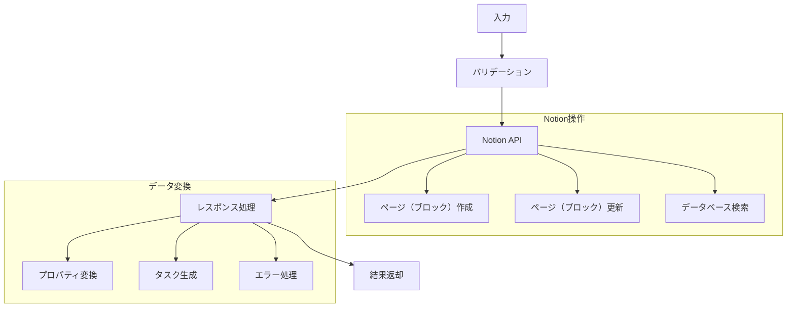

# NotionService - Notionインターフェースモジュール

## 目次
1. [概要](#概要)
2. [主要機能](#主要機能)
3. [実装詳細](#実装詳細)
4. [処理フロー](#処理フロー)
5. [使用例](#使用例)
6. [コンポーネント間の連携](#コンポーネント間の連携)

## 概要

NotionServiceは、タスクの永続化とデータベース管理を行うモジュールである。NotionのAPIを使用してタスクの作成、更新、検索などの操作を提供し、データの永続化を実現する。

### 特徴
- タスクの永続化
- データベース管理
- APIを介した操作
- エラーハンドリング

## 主要機能

### 1. タスク管理
- タスクの作成
- タスクの更新
- タスクの検索
- タスク一覧の取得

### 2. データベース操作
- ページの作成
- プロパティの更新
- フィルタリング
- ソート

### 3. データ変換
- Taskオブジェクトの変換
- Notionプロパティの変換
- レスポンスの整形
- エラーハンドリング

## 実装詳細

### クラス構成

```python
class NotionService:
    """
    Notionとの連携機能を提供し、
    タスクの永続化とデータベース管理を行う
    
    Attributes:
        client: Notion APIクライアント
        database_id: NotionデータベースID
    """
    
    def __init__(self, api_key: str, database_id: str):
        """
        Args:
            api_key: Notion API キー
            database_id: データベースID
        """
        self.client = Client(auth=api_key)
        self.database_id = database_id
```

### 主要メソッド

#### 1. add_task メソッド（タスク追加：新規タスクをNotionデータベースに追加）

```python
def add_task(self, task_info: Dict[str, Any]) -> Dict[str, Any]:
    """
    タスクの追加
    
    Args:
        task_info: タスク情報の辞書
        
    Returns:
        Dict[str, Any]: {
            "success": bool,
            "message": str,
            "task": Optional[Task]
        }
    """
    try:
        # Notionプロパティの作成
        properties = self._create_properties(task_info)
        
        # ページの作成
        response = self.client.pages.create(
            parent={"database_id": self.database_id},
            properties=properties
        )
        
        # タスクオブジェクトの作成
        task = self._response_to_task(response)
        
        return {
            "success": True,
            "message": "タスクを追加しました",
            "task": task
        }
        
    except Exception as e:
        return {
            "success": False,
            "message": f"タスクの追加に失敗しました: {str(e)}"
        }
```

このメソッドは、新規タスクをNotionデータベースに追加する。以下の処理を実行する。

1. プロパティの作成
   - タスク情報をNotionプロパティに変換
   - 必須フィールドの設定

2. ページ（ブロック）の作成
   - APIを使用してページ（ブロック）を作成
   - レスポンスの取得

3. 結果の返却
   - 成功時：タスクオブジェクトを含む結果
   - 失敗時：エラーメッセージ

#### 2. list_tasks メソッド（タスク一覧の取得：フィルター条件に基づくタスク一覧の取得）
```python
def list_tasks(self, filters: Dict[str, Any] = None) -> Dict[str, Any]:
    """
    タスク一覧の取得
    
    Args:
        filters: フィルター条件
        
    Returns:
        Dict[str, Any]: {
            "success": bool,
            "message": str,
            "tasks": List[Task]
        }
    """
    try:
        # フィルター条件の構築
        filter_params = self._build_filters(filters)
        
        # タスク一覧の取得
        response = self.client.databases.query(
            database_id=self.database_id,
            filter=filter_params
        )
        
        # タスクオブジェクトへの変換
        tasks = [self._response_to_task(page) for page in response["results"]]
        
        # タスク一覧の整形
        if not tasks:
            return {
                "success": True,
                "message": "タスクはありません",
                "tasks": []
            }
            
        message = "📝 タスク一覧:\n" + "\n".join(str(task) for task in tasks)
        
        return {
            "success": True,
            "message": message,
            "tasks": tasks
        }
        
    except Exception as e:
        return {
            "success": False,
            "message": f"タスク一覧の取得に失敗しました: {str(e)}"
        }
```

このメソッドは、フィルター条件に基づいてタスク一覧を取得する。以下の処理を実行する。

1. フィルター条件の構築
   - ステータス、優先度などのフィルター
   - 期限切れ判定の条件

2. データベースのクエリ
   - APIを使用してタスク検索
   - 結果の取得

3. レスポンスの整形
   - タスクオブジェクトへの変換
   - 一覧表示用の文字列生成

#### 3. update_task_status メソッド（タスク状態の更新：既存タスクのステータスを更新）
```python
def update_task_status(self, title: str, status: str) -> Dict[str, Any]:
    """
    タスクのステータス更新
    
    Args:
        title: タスクのタイトル
        status: 新しいステータス
        
    Returns:
        Dict[str, Any]: {
            "success": bool,
            "message": str,
            "task": Optional[Task]
        }
    """
    try:
        # タスクの検索
        task_id = self._find_task_by_title(title)
        if not task_id:
            return {
                "success": False,
                "message": f"タスク '{title}' が見つかりません"
            }
            
        # ステータスの更新
        response = self.client.pages.update(
            page_id=task_id,
            properties={
                "Status": {"select": {"name": status}}
            }
        )
        
        # 更新後のタスクオブジェクト作成
        task = self._response_to_task(response)
        
        return {
            "success": True,
            "message": f"タスク '{title}' のステータスを '{status}' に更新しました",
            "task": task
        }
        
    except Exception as e:
        return {
            "success": False,
            "message": f"タスクの更新に失敗しました: {str(e)}"
        }
```

このメソッドは、既存タスクのステータスを更新する。以下の処理を実行する。

1. タスクの検索
   - タイトルによるタスク検索
   - タスクIDの取得

2. ステータスの更新
   - APIを使用してプロパティ更新
   - 更新結果の取得

3. レスポンスの生成
   - 更新後のタスク情報
   - 成功/エラーメッセージ

#### 4. _create_properties メソッド（プロパティ作成：タスク情報をNotionプロパティに変換）
```python
def _create_properties(self, task_info: Dict[str, Any]) -> Dict[str, Any]:
    """
    Notionプロパティの作成
    
    Args:
        task_info: タスク情報
        
    Returns:
        Dict[str, Any]: Notionプロパティ
    """
    properties = {
        "Title": {"title": [{"text": {"content": task_info["title"]}}]},
        "Status": {"select": {"name": task_info.get("status", "未着手")}},
        "Priority": {"select": {"name": task_info.get("priority", "中")}}
    }
    
    if "due_date" in task_info:
        properties["DueDate"] = {"date": {"start": task_info["due_date"]}}
        
    if "categories" in task_info:
        properties["Categories"] = {
            "multi_select": [{"name": cat} for cat in task_info["categories"]]
        }
        
    return properties
```

このメソッドは、タスク情報をNotionのプロパティ形式に変換する。以下の処理を実行する。

1. 基本プロパティの設定
   - タイトル（必須）
   - ステータス（デフォルト：未着手）
   - 優先度（デフォルト：中）

2. オプションプロパティの設定
   - 期限日（存在する場合）
   - カテゴリ（存在する場合）

#### 5. _response_to_task メソッド（レスポンス変換：NotionレスポンスからTaskオブジェクトを生成）
```python
def _response_to_task(self, response: Dict[str, Any]) -> Task:
    """
    NotionレスポンスからTaskオブジェクトを生成
    
    Args:
        response: Notionのレスポンス
        
    Returns:
        Task: タスクオブジェクト
    """
    properties = response["properties"]
    
    # 基本情報の取得
    title = properties["Title"]["title"][0]["text"]["content"]
    status = properties["Status"]["select"]["name"]
    priority = properties["Priority"]["select"]["name"]
    
    # オプション情報の取得
    due_date = None
    if "DueDate" in properties and properties["DueDate"]["date"]:
        due_date = properties["DueDate"]["date"]["start"]
        
    categories = []
    if "Categories" in properties:
        categories = [
            item["name"] 
            for item in properties["Categories"]["multi_select"]
        ]
        
    # タスクオブジェクトの作成
    return Task(
        title=title,
        status=status,
        priority=priority,
        due_date=due_date,
        categories=categories
    )
```

このメソッドは、NotionのAPIレスポンスからTaskオブジェクトを生成する。以下の処理を実行する。

1. 基本情報の抽出
   - タイトルの取得
   - ステータスの取得
   - 優先度の取得

2. オプション情報の抽出
   - 期限日の取得と変換
   - カテゴリリストの作成

3. タスクオブジェクトの生成
   - 抽出した情報を使用
   - Taskクラスのインスタンス化

#### 6. _build_filters メソッド（フィルター構築：検索条件をNotionフィルター形式に変換）
```python
def _build_filters(self, filters: Dict[str, Any] = None) -> Dict[str, Any]:
    """
    Notionフィルターの構築
    
    Args:
        filters: フィルター条件
        
    Returns:
        Dict[str, Any]: Notionフィルター
    """
    if not filters:
        return {}
        
    notion_filters = []
    
    # ステータスフィルター
    if "status" in filters:
        notion_filters.append({
            "property": "Status",
            "select": {"equals": filters["status"]}
        })
        
    # 優先度フィルター
    if "priority" in filters:
        notion_filters.append({
            "property": "Priority",
            "select": {"equals": filters["priority"]}
        })
        
    # カテゴリフィルター
    if "categories" in filters:
        notion_filters.append({
            "property": "Categories",
            "multi_select": {"contains": filters["categories"]}
        })
        
    # 期限切れフィルター
    if filters.get("overdue"):
        notion_filters.append({
            "property": "DueDate",
            "date": {"before": datetime.now().date().isoformat()}
        })
        
    return {"and": notion_filters} if notion_filters else {}
```

このメソッドは、検索条件をNotionのフィルター形式に変換する。以下の処理を実行する。

1. フィルター条件の変換
   - ステータスによるフィルター
   - 優先度によるフィルター
   - カテゴリによるフィルター

2. 特殊条件の処理
   - 期限切れ判定
   - 日付範囲の指定

3. フィルターの結合
   - AND条件での結合
   - 空フィルターの処理

#### 7. _find_task_by_title メソッド（タスク検索：タイトルによるタスクの検索）
```python
def _find_task_by_title(self, title: str) -> Optional[str]:
    """
    タイトルによるタスク検索
    
    Args:
        title: タスクのタイトル
        
    Returns:
        Optional[str]: タスクID（見つからない場合はNone）
    """
    try:
        response = self.client.databases.query(
            database_id=self.database_id,
            filter={
                "property": "Title",
                "title": {"equals": title}
            }
        )
        
        if response["results"]:
            return response["results"][0]["id"]
            
        return None
        
    except Exception:
        return None
```

このメソッドは、タイトルを使用してタスクを検索する。以下の処理を実行する。

1. 検索条件の構築
   - タイトルの完全一致
   - フィルターの設定

2. データベース検索
   - APIを使用した検索
   - 結果の取得

3. タスクIDの抽出
   - 最初の一致結果
   - 見つからない場合はNone

## 処理フロー

### タスク操作フロー


## 使用例

### 基本的な使用方法

```python
# NotionServiceの初期化
notion_service = NotionService(api_key, database_id)

# タスクの追加
task_info = {
    "title": "機械学習レポート",
    "due_date": "2024-11-22",
    "priority": "高",
    "categories": ["機械学習", "提出物"]
}

result = notion_service.add_task(task_info)
print(result["message"])  # "タスクを追加しました"

# タスク一覧の取得
result = notion_service.list_tasks({"status": "未着手"})
print(result["message"])
# 出力:
# 📝 タスク一覧:
# ・機械学習レポート
#   状態: 未着手 | 優先度: 高 | 期限: 2024-11-22(緊急) | 分野: 機械学習, 提出物

# タスクの更新
result = notion_service.update_task_status("機械学習レポート", "完了")
print(result["message"])  # "タスク'機械学習レポート'のステータスを'完了'に更新しました"
```

### エラーハンドリング例

```python
# 無効なタスク情報
result = notion_service.add_task({})
print(result["message"])  # "タスクの追加に失敗しました: タイトルは必須です"

# 存在しないタスクの更新
result = notion_service.update_task_status("存在しないタスク", "完了")
print(result["message"])  # "タスク'存在しないタスク'が見つかりません"

# APIエラー
result = notion_service.list_tasks({"invalid": "filter"})
print(result["message"])  # "タスク一覧の取得に失敗しました: Invalid filter"
```

## コンポーネント間の連携

### 1. SlackServiceとの連携
SlackServiceとの連携フローについては、[SlackService コンポーネント間の連携](slack_service.md#コンポーネント間の連携)を参照。

### 2. AIInferenceとの連携
NotionServiceは、AIInferenceが生成したタスク情報を永続化する。

1. **AI解析結果の保存**
   ```python
   # AIInferenceでの解析
   ai_result = ai_inference.analyze_text(
       "明日までに機械学習のレポートを提出する必要がある"
   )
   
   # NotionServiceでの保存
   notion_service.add_task({
       "title": ai_result["title"],
       "due_date": ai_result["deadline"],
       "priority": ai_result["priority"],
       "categories": ai_result["categories"]
   })
   ```

### 3. TaskModelとの連携
NotionServiceは、TaskModelのインスタンスを生成・管理し、Notionとの同期を行う。

1. **データの相互変換**
   ```python
   # NotionレスポンスからTaskオブジェクトへの変換
   task = notion_service._response_to_task(notion_response)
   
   # TaskオブジェクトからNotionプロパティへの変換
   properties = notion_service._create_properties(task.__dict__)
   ```

### 4. データの整合性管理
各コンポーネント間でのデータの一貫性を保証する。

1. **ステータスの同期**
   - Slack上での更新をNotionに反映
   - Notion上での変更をSlackに通知

2. **カテゴリの統一**
   - TaskModelの定義に基づくカテゴリの検証
   - AIInferenceの推定結果の正規化

3. **優先度の調整**
   - 期限に基づく動的な優先度更新
   - AI推定結果との整合性確保