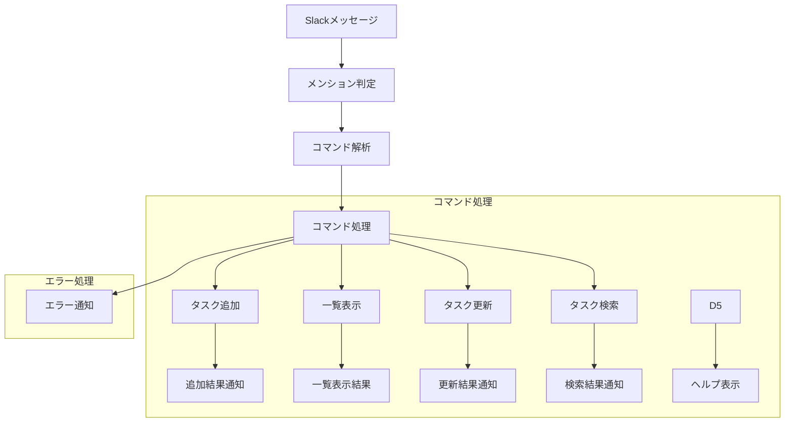

# SlackService - Slackインターフェースモジュール

## 目次
1. [概要](#概要)
2. [主要機能](#主要機能)
3. [実装詳細](#実装詳細)
4. [処理フロー](#処理フロー)
5. [使用例](#使用例)

## 概要

SlackServiceは、Slackでのコマンド処理とタスク管理機能を提供し、Notionと連携してタスクの永続化を行うモジュールである。ユーザーとの対話を通じて、タスクの作成、更新、一覧表示などの操作を実現する。

### 特徴
- Slackコマンドの処理
- タスク管理機能の提供
- Notionとの連携
- エラーハンドリング

## 主要機能

### 1. コマンド処理
- タスクの追加（add）
- タスク一覧の表示（list）
- タスクの更新（update）
- タスクの検索（search）
- ヘルプの表示（help）

### 2. タスク管理
- タスク情報の解析
- 優先度のフィルタリング
- カテゴリのフィルタリング
- 期限切れタスクの表示

### 3. メッセージ処理
- メンションの処理
- コマンドの解析
- 応答の生成
- エラー通知

## 実装詳細

### クラス構成

```python
class SlackService:
    """
    Slackでのコマンド処理とタスク管理機能を提供
    Notionと連携してタスクの永続化を行う
    
    Attributes:
        app: Slackアプリケーションインスタンス
        notion_service: Notionサービスインスタンス
        text_parser: テキスト解析インスタンス
    """
    
    # コマンド定義
    COMMANDS = {
        "add": "タスクを追加",
        "list": "タスク一覧を表示",
        "update": "タスクを更新",
        "help": "ヘルプを表示",
        "search": "タスクを検索",
        "priority": "優先度でフィルター",
        "category": "カテゴリでフィルター",
        "overdue": "期限切れタスクを表示"
    }
```

### 主要メソッド

#### 1. start メソッド（アプリケーションの起動：Slackアプリケーションを起動し、イベント待ち受けを開始）
```python
def start(self, app_token):
    """
    アプリケーションの起動
    
    Args:
        app_token: Slackアプリケーショントークン
    """
    handler = SocketModeHandler(self.app, app_token)
    handler.start()
```

このメソッドは、Slackアプリケーションを起動し、WebSocketベースの通信を確立する。SocketModeHandlerを使用することで、リアルタイムなイベント処理が可能になる。

#### 2. setup_handlers メソッド（イベントハンドラの設定：Slackイベントに対する処理を定義）
```python
def setup_handlers(self):
    """
    Slackイベントハンドラの設定
    メンションとメッセージのイベントを処理
    """
    @self.app.event("app_mention")
    def handle_mention(event, say):
        """
        メンション時の処理
        
        Args:
            event: Slackイベント
            say: メッセージ送信関数
        """
        try:
            text = self._clean_mention(event["text"])
            self._process_command(text, say)
        except Exception as e:
            say(f"申し訳ありません。エラーが発生しました: {str(e)}")

    @self.app.event("message")
    def handle_message(event, say):
        """
        メッセージ受信時の処理
        ボットからのメッセージは無視
        
        Args:
            event: Slackイベント
            say: メッセージ送信関数
        """
        if event.get("subtype") == "bot_message" or "bot_id" in event:
            return
```

このメソッドは、Slackのイベントに対する処理を定義する。メンションを受け取ると、テキストからメンション部分を除去し、コマンドとして解析して実行する。エラーが発生した場合は、ユーザーにエラーメッセージを通知する。

#### 3. _clean_mention メソッド（メンションの除去：メンション部分を除去し、コマンド部分を抽出）
```python
def _clean_mention(self, text):
    """
    メンションの除去と文字列の正規化
    
    Args:
        text (str): 入力テキスト
        
    Returns:
        str: 正規化されたテキスト
    """
    # メンションの除去
    text = ' '.join(word for word in text.split() if not word.startswith('<@'))
    
    # 全角文字の正規化
    text = text.replace('：', ':').replace('、', ',').replace('　', ' ')
    
    # 余分な空白の除去
    text = ' '.join(text.split())
    
    return text
```

このメソッドは、Slackのメッセージからメンション部分を除去し、コマンドとして解析可能な形式に正規化する。以下の処理を行う。

1. メンション部分の除去
   - `<@USERID>`形式のメンションを削除
   - スペースで区切られた単語のリストを作成

2. 全角文字の正規化
   - 全角コロン（：）を半角（:）に変換
   - 全角カンマ（、）を半角（,）に変換
   - 全角スペース（　）を半角（ ）に変換

3. 余分な空白の除去
   - 連続するスペースを1つに統合
   - 先頭と末尾の空白を削除

#### 4. _process_command メソッド（コマンドの解析と実行：ユーザー入力を解析し適切な処理を実行）
```python
def _process_command(self, text: str, say):
    """
    コマンドの解析と実行
    
    Args:
        text: コマンドテキスト
        say: メッセージ送信関数
    """
    try:
        # タスク管理コマンドの判定
        if text.startswith(tuple(self.COMMANDS.keys())) or \
           any(keyword in text for keyword in ["タスク", "課題", "予定"]):
            # 1. 入力解析
            command, args = self._parse_command(text)
            
            # 2. コマンド処理
            if not command:
                self._show_help(say)
                return
                
            # 3. コマンドの実行
            command_handlers = {
                "add": self._handle_add,
                "list": self._handle_list,
                "update": self._handle_update,
                "help": self._show_help,
                "search": self._handle_search,
                "priority": self._handle_priority_filter,
                "category": self._handle_category_filter,
                "overdue": self._handle_overdue
            }
            
            if command in command_handlers:
                command_handlers[command](args, say)
            else:
                self._show_help(say)
                
    except Exception as e:
        say(f"コマンドの処理中にエラーが発生しました: {str(e)}")
```

このメソッドは、ユーザーからの入力を解析し、適切なコマンドハンドラを呼び出す。以下の処理を行う。

1. コマンドの判定
   - 登録済みコマンドで始まるか確認
   - タスク関連キーワードを含むか確認

2. コマンドと引数の分離
   - コマンド部分の抽出
   - 引数部分の抽出

3. コマンドの実行
   - 対応するハンドラの呼び出し
   - エラー時のヘルプ表示

#### 5. _parse_command メソッド（コマンドの解析：入力テキストからコマンドと引数を抽出）
```python
def _parse_command(self, text: str) -> Tuple[str, str]:
    """
    コマンドの解析
    
    Args:
        text: 入力テキスト
        
    Returns:
        Tuple[str, str]: (コマンド, 引数)
    """
    parts = text.strip().split(maxsplit=1)
    command = parts[0].lower()
    args = parts[1] if len(parts) > 1 else ""
    return command, args
```

このメソッドは、入力テキストからコマンドと引数を抽出する。以下の処理を行う。

1. テキストの前処理
   - 先頭と末尾の空白を削除
   - 最初のスペースで分割

2. コマンドの抽出
   - 最初の単語を小文字に変換
   - コマンドとして認識

3. 引数の抽出
   - 残りのテキストを引数として取得
   - 引数がない場合は空文字を返す

#### 6. _handle_add メソッド（タスク追加の処理：新規タスクの作成と保存）
```python
def _handle_add(self, args: str, say):
    """
    タスク追加の処理
    
    Args:
        args: タスク情報を含む文字列
        say: メッセージ送信関数
    """
    if not args:
        say("タスクの情報を入力してください。")
        return
        
    # テキスト解析
    task_info = self.text_parser.parse_task_info(args)
    if not task_info:
        say("タスク情報の解析に失敗しました。")
        return
        
    # タスクの作成と保存
    result = self.notion_service.add_task(task_info)
    
    # 応答の生成
    if result["success"]:
        response = [
            f"✅ {result['message']}",
            "タスクの詳細:",
            str(result["task"])
        ]
        say("\n".join(response))
    else:
        say(f"❌ {result['message']}")
```

このメソッドは、新規タスクの作成と保存を行う。以下の処理を実行する。

1. 入力チェック
   - 引数の存在確認
   - 空文字のチェック

2. テキスト解析
   - 自然言語からタスク情報を抽出
   - 構造化データへの変換

3. タスクの保存
   - Notionへのタスク保存
   - 結果の確認

4. 応答生成
   - 成功時：タスク詳細の表示
   - 失敗時：エラーメッセージの表示

#### 7. _handle_list メソッド（タスク一覧の処理：タスク一覧の取得と表示）
```python
def _handle_list(self, args: str, say):
    """
    タスク一覧の処理
    
    Args:
        args: フィルター条件
        say: メッセージ���信関数
    """
    # フィルター条件の解析
    filters = {}
    if args:
        # フィルター条件の解析
        if args in [Task.STATUS_NOT_STARTED, Task.STATUS_IN_PROGRESS, Task.STATUS_COMPLETED]:
            filters["status"] = args
            
    # タスク一覧の取得
    result = self.notion_service.list_tasks(filters)
    
    # 応答の生成
    if result["success"]:
        say(result["message"] or "タスクはありません")
    else:
        say(f"❌ {result['message']}")
```

このメソッドは、タスク一覧の取得と表示を行う。以下の処理を実行する。

1. フィルター条件の解析
   - ステータスによるフィルタリング
   - 未着手/進行中/完了の判定

2. タスク一覧の取得
   - Notionからのタスク取得
   - フィルター適用

3. 応答の生成
   - タスク一覧の整形
   - エラー時のメッセージ

#### 8. _handle_update メソッド（タスク更新の処理：既存タスクの状態を更新）
```python
def _handle_update(self, args: str, say):
    """
    タスク更新の処理
    
    Args:
        args: タスク名とステータス
        say: メッセージ送信関数
    """
    if not args:
        say("使用方法: update タスク名 ステータス\n"
            "例: update レポート作成 完了")
        return
        
    words = args.split()
    if len(words) < 2:
        say("タスク名とステータスを指定してください。")
        return
        
    status = words[-1]
    task_title = ' '.join(words[:-1])
    
    if not Task.validate_status(status):
        say("ステータスは「未着手」「進行中」「完了」のいずれかを指定してください。")
        return
        
    # タスクの更新
    result = self.notion_service.update_task_status(task_title, status)
    
    # 応答の生成
    if result["success"]:
        response = [
            f"✅ {result['message']}",
            "更新後の詳細:",
            str(result["task"])
        ]
        say("\n".join(response))
    else:
        say(f"❌ {result['message']}")
```
このメソッドは、既存タスクのステータスを更新する。以下の処理を実行する。
1. 入力チェック
   - 引数の存在確認
   - 形式の確認（タスク名とステータス）

2. ステータスの検証
   - 有効なステータス値の確認
   - 未着手/進行中/完了のいずれか

3. タスクの更新
   - Notionでのタスク更新
   - 結果の確認

4. 応答生成
   - 成功時：更新後のタスク詳細
   - 失敗時：エラーメッセージ
   
#### 9. _handle_search メソッド（タスク検索の処理：キーワードによるタスク検索）
```python
def _handle_search(self, args: str, say):
    """
    タスク検索の処理
    
    Args:
        args: 検索キーワード
        say: メッセージ送信関数
    """
    if not args:
        say("検索キーワードを入力してください。")
        return
        
    # 検索の実装（今後の課題）
    say("検索機能は現在開発中です。")
```

このメソッドは、キーワードによるタスク検索を行う。
この機能は開発中である。

#### 10. _handle_priority_filter メソッド（優先度フィルタの処理：優先度によるタスクのフィルタリング）
```python
def _handle_priority_filter(self, args: str, say):
    """
    優先度フィルターの処理
    
    Args:
        args: 優先度（高/中/低）
        say: メッセージ送信関数
    """
    if not args or args not in ["高", "中", "低"]:
        say("優先度は「高」「中」「低」のいずれかを指定してください。")
        return
        
    filters = {"priority": args}
    result = self.notion_service.list_tasks(filters)
    
    if result["success"]:
        say(result["message"] or f"優先度「{args}」のタスクはありません")
    else:
        say(f"❌ {result['message']}")
```

このメソッドは、指定された優先度でタスクをフィルタリングする。以下の処理を実行する。

1. 入力値の検証
   - 優先度の存在確認
   - 有効な優先度値（高/中/低）の確認

2. フィルタリング
   - 優先度に基づくフィルター条件の作成
   - Notionでのタスク検索

3. 結果の表示
   - フィルタリング結果の整形
   - エラー時のメッセージ表示

#### 11. _handle_category_filter メソッド（カテゴリフィルタの処理：カテゴリによるタスクのフィルタリング）
```python
def _handle_category_filter(self, args: str, say):
    """
    カテゴリフィルターの処理
    
    Args:
        args: カテゴリ名
        say: メッセージ送信関数
    """
    if not args or args not in Task.VALID_CATEGORIES:
        say(f"カテゴリは {', '.join(Task.VALID_CATEGORIES)} のいずれかを指定してください。")
        return
        
    filters = {"categories": args}
    result = self.notion_service.list_tasks(filters)
    
    if result["success"]:
        say(result["message"] or f"分野「{args}」のタスクはありません")
    else:
        say(f"❌ {result['message']}")
```
このメソッドは、指定されたカテゴリでタスクをフィルタリングする。以下の処理を実行する。

1. カテゴリの検証
   - カテゴリの存在確認
   - 有効なカテゴリ値の確認

2. タスクの検索
   - カテゴリに基づくフィルタリング
   - 該当タスクの取得

3. 結果の表示
   - タスク一覧の整形
   - 該当タスクがない場合のメッセージ

#### 12. _handle_overdue メソッド（期限切れタスクの処理：期限切れタスクの表示）
```python
def _handle_overdue(self, args: str, say):
    """
    期限切れタスクの処理
    
    Args:
        args: 未使用
        say: メッセージ送信関数
    """
    filters = {"overdue": True}
    result = self.notion_service.list_tasks(filters)
    
    if result["success"]:
        say(result["message"] or "期限切れのタスクはありません")
    else:
        say(f"❌ {result['message']}")
```

このメソッドは、期限切れのタスクを表示する。以下の処理を実行する：

1. フィルター条件の設定
   - 期限切れフラグの設定
   - 検索条件の構築

2. タスクの取得
   - Notionからの期限切れタスク取得
   - 結果の確認

3. 応答の生成
   - タスク一覧の表示
   - タスクがない場合のメッセージ

#### 13. _show_help メソッド（ヘルプの表示：使用可能なコマンドの説明を表示）
```python
def _show_help(self, args: str, say):
    """
    ヘルプメッセージの表示
    
    Args:
        args: 未使用
        say: メッセージ送信関数
    """
    # カテゴリリストを動的に生成
    category_list = "・".join(Task.VALID_CATEGORIES)
    
    help_text = [
        "🤖 *使用可能なコマンド:*",
        "",
        "*1. タスクの追加*",
        "```add タスク名 | 期限:YYYY-MM-DD | 優先度:高/中/低 | 分野:カテゴリー```",
        "または",
        "```add タスクの説明（自然言語）```",
        "",
        "*2. タスクの一覧表示*",
        "```list [状態]```",
        "- 状態: 未着手/進行中/完了",
        "",
        "*3. タスクの更新*",
        "```update タスク名 状態```",
        "",
        "*4. その他の機能*",
        "- `priority 優先度`: 優先度でフィルター",
        "- `category 分野`: 分野でフィルター",
        f"- 分野: {category_list}",
        "- `overdue`: 期限切れタスクを表示",
        "",
        "*💡 使用例:*",
        "1. `add レポート作成 | 期限:2024-03-20 | 優先度:高 | 分野:数学`",
        "2. `add 明日までに数学のレポートを提出`",
        "3. `list 未着手`",
        "4. `update レポート作成 完了`"
    ]
    
    say("\n".join(help_text))
```

このメソッドは、使用可能なコマンドの説明を表示する。以下の処理を実行する。

1. ヘルプテキストの生成
   - コマンド一覧の作成
   - 使用例の追加
   - カテゴリリストの動的生成

2. フォーマット
   - Markdown形式での整形
   - 見出しと箇条書きの適用

3. メッセージ送信
   - 整形されたヘルプの表示
   - コードブロックの適用

## 処理フロー

### コマンド処理フロー


## 使用例

### 基本的な使用方法

```python
# SlackServiceの初期化
slack_service = SlackService(config, notion_service)

# タスクの追加
@slack_service.app.event("app_mention")
def handle_mention(event, say):
    text = "add 機械学習レポート | 期限:2024-11-22 | 優先度:高 | 分野:機械学習"
    slack_service._process_command(text, say)
    # 出力:
    # ✅ タスクを追加しました
    # タスクの詳細:
    # ・機械学習レポート
    #   状態: 未着手 | 優先度: 高 | 期限: 2024-11-22(緊急) | 分野: 機械学習

# タスク一覧の表示
@slack_service.app.event("app_mention")
def handle_mention(event, say):
    text = "list"
    slack_service._process_command(text, say)
    # 出力:
    # 📝 タスク一覧:
    # ・機械学習レポート
    #   状態: 未着手 | 優先度: 高 | 期限: 2024-11-22(緊急) | 分野: 機械学習
```

### エラーハンドリング例

```python
# 無効なコマンド
@slack_service.app.event("app_mention")
def handle_mention(event, say):
    text = "invalid_command"
    slack_service._process_command(text, say)
    # 出力: ヘルプメッセージ

# タスク追加時のエラー
@slack_service.app.event("app_mention")
def handle_mention(event, say):
    text = "add"  # 引数なし
    slack_service._process_command(text, say)
    # 出力: "タスクの情報を入力してくだい。"
```