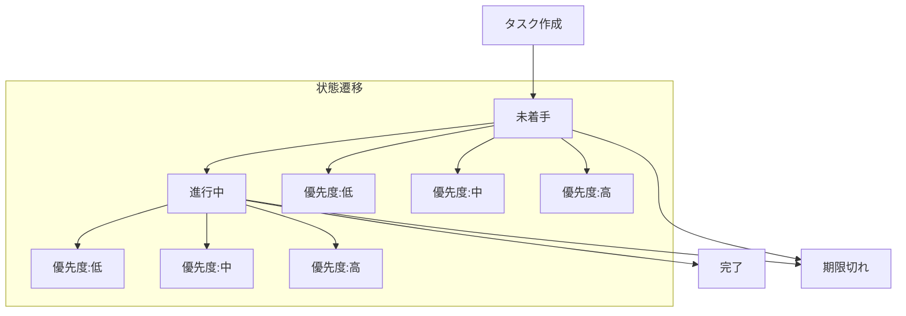

# TaskModel - タスクデータモジュール

## 目次
1. [概要](#概要)
2. [主要機能](#主要機能)
3. [実装詳細](#実装詳細)
4. [処理フロー](#処理フロー)
5. [使用例](#使用例)

## 概要

TaskModelは、タスクの基本情報と状態を管理し、Notionとの連携に必要な変換機能を提供するモジュールである。タスクの属性、状態遷移、バリデーションロジックを定義する。

### 特徴
- タスク属性の定義と管理
- 状態遷移の制御
- バリデーションルールの実装
- Notion連携用の変換機能

## 主要機能

### 1. タスク属性管理
- 基本属性
  - タイトル（必須）
  - 期限（YYYY-MM-DD形式）
  - 優先度（高/中/低）
  - ステータス（未着手/進行中/完了）
  - カテゴリ情報（機械学習、統計学、開発など）

### 2. バリデーション
- 属性値の検証
- 日付形式の確認
- 必須項目の確認
- カテゴリの値域確認

### 3. 状態管理
- ステータスの遷移制御
- 期限切れの判定（現在日付と期限日を比較し、期限超過を判定）
- 残り日数の計算（期限日と現在日付の差分を日数で計算）
- 緊急度の判定（残り日数に基づいて7段階の緊急度を判定）
- 優先度の動的調整（期限との近さに応じて優先度を自動調整）

## 実装詳細

### クラス定義

```python
class Task:
    """
    タスクの基本情報と状態を管理し、
    Notionとの連携に必要な変換機能を提供
    
    Attributes:
        title (str): タスクのタイトル
        due_date (str): 期限日（YYYY-MM-DD形式）
        priority (str): 優先度（高/中/低）
        categories (List[str]): カテゴリ
        status (str): 状態（未着手/進行中/完了）
        description (str): タスクの詳細説明
    """
    
    # ステータス定義
    STATUS_NOT_STARTED = "未着手"
    STATUS_IN_PROGRESS = "進行中"
    STATUS_COMPLETED = "完了"

    # 優先度の定数
    PRIORITY_HIGH = "高"
    PRIORITY_MEDIUM = "中"
    PRIORITY_LOW = "低"
    
    # 優先度定義
    PRIORITY_KEYWORDS = {
        PRIORITY_HIGH: [
            "重要", "急ぎ", "必須", "絶対", "今すぐ",
            "かなり", "急いで", "やばい", "早く",
            "至急", "即時", "緊急", "すぐ", 
        ],
        PRIORITY_MEDIUM: [
            "なるべく", "できれば", "そろそろ",
            "準備", "確認", "検討"
        ],
        PRIORITY_LOW: [
            "余裕", "ゆっくり", "暇なとき",
            "時間があれば", "後で"
        ]
    }

    # 信頼度の定数定義
    CONFIDENCE = {
        "BASE": 0.5,      # 基準値：キーワードマッチングの基本的な信頼性
        "INCREMENT": 0.1,  # 増分値：キーワードマッチごとの信頼度上昇
        "MAX": 1.0,       # 最大値：完全なマッチ
        "THRESHOLD": 0.3,  # 最低閾値：AI判定で有効とみなす最低ライン
        "TITLE": 0.8,     # タイトルの基本信頼度
        
        # AIモデルの重み付け
        "MODEL_WEIGHTS": {
            "LASER": 0.5,    # 文全体の理解に重点
            "WORD2VEC": 0.3, # 単語の意味理解
            "FASTTEXT": 0.2  # 未知語処理に補助的に使用
        }
    }

    # 優先度と緊急度の定義
    URGENCY_LEVELS = {
        "期限切れ": {
            "days": -1,
            "priority": PRIORITY_HIGH,
            "confidence": CONFIDENCE["MAX"]
        },
        "今日まで": {
            "days": 0,
            "priority": PRIORITY_HIGH,
            "confidence": 0.9
        },
        "明日まで": {
            "days": 1,
            "priority": PRIORITY_HIGH,
            "confidence": 0.9
        },
        "緊急": {
            "days": 3,
            "priority": PRIORITY_HIGH,
            "confidence": 0.8
        },
        "要注意": {
            "days": 7,
            "priority": PRIORITY_HIGH,
            "confidence": 0.7
        },
        "注意": {
            "days": 14,
            "priority": PRIORITY_MEDIUM,
            "confidence": 0.6
        },
        "余裕あり": {
            "days": float('inf'),
            "priority": PRIORITY_LOW,
            "confidence": 0.5
        }
    }
```


### 主要メソッド

#### 1. is_overdue メソッド（期限切れの判定：現在日付と期限日を比較し、期限超過を判定）

```python
def is_overdue(self) -> bool:
    """
    期限切れかどうかを判定
    
    Returns:
        bool: 期限切れの場合True
    """
    if not self.due_date:
        return False
    return datetime.strptime(self.due_date, '%Y-%m-%d').date() < datetime.now().date()
```

このメソッドは、タスクが期限切れかどうかを判定する。期限が設定されていない場合はFalseを返す。期限が設定されている場合は、現在日付と期限日を比較し、期限日が過去の場合はTrueを返す。日付の比較には`datetime`モジュールを使用し、日付オブジェクトに変換して比較を行う。

以下、期限切れの判定例を示す。

```python
# 期限切れタスクの例
task1 = Task(
    title="レポート提出",
    due_date="2024-03-15"  # 過去の日付（2024年11月17日現在）
)
print(task1.is_overdue())  # True

# 期限内タスクの例
task2 = Task(
    title="プレゼン準備",
    due_date="2024-12-25"  # 未来の日付（2024年11月17日現在）
)
print(task2.is_overdue())  # False

# 期限なしタスクの例
task3 = Task(
    title="資料整理",
    due_date=None
)
print(task3.is_overdue())  # False
```

#### 2. days_until_due メソッド（残り日数の計算：期限日と現在日付の差分を日数で計算）

```python
def days_until_due(self) -> Optional[int]:
    """
    期限までの残り日数を計算
    
    Returns:
        Optional[int]: 残り日数（期限なしの場合はNone）
    """
    if not self.due_date:
        return None
    return (datetime.strptime(self.due_date, '%Y-%m-%d').date() - datetime.now().date()).days
```

このメソッドは、タスクの期限までの残り日数を計算する。期限が設定されていない場合はNoneを返す。期限切れの場合は負の値、期限内の場合は正の値を返す。日付の計算には`datetime`モジュールを使用し、現在日付との差分を日数で取得する。

以下、残り日数の計算例を示す。

```python
# 期限切れタスク
task1 = Task(
    title="レポート提出",
    due_date="2024-11-12"  # 2024年11月17日現在
)
print(task1.days_until_due())  # -5（5日経過）

# 期限が近いタスク
task2 = Task(
    title="プレゼン準備",
    due_date="2024-11-22"  # 2024年11月17日現在
)
print(task2.days_until_due())  # 5（残り5日）

# 期限なしタスク
task3 = Task(
    title="資料整理",
    due_date=None
)
print(task3.days_until_due())  # None
```

#### 3. get_urgency_level メソッド（緊急度の判定：残り日数に基づいて7段階の緊急度を判定）

```python
def get_urgency_level(self) -> str:
    """
    タスクの緊急度を判定
    
    Returns:
        str: 緊急度レベル（期限切れ/今日まで/明日まで/緊急/要注意/余裕あり/不明）
    """
    if not self.due_date:
        return "不明"
        
    days = self.days_until_due()
    return self.get_priority_from_days(days)["urgency"]
```

このメソッドは、タスクの緊急度レベルを判定する。期限までの残り日数に基づいて、`URGENCY_LEVELS`で定義された基準に従って緊急度を判定する。期限が設定されていない場合は「不明」を返す。緊急度は期限との近さに応じて段階的に変化し、それぞれの段階で異なる信頼度が設定される。

以下、緊急度判定の例を示す。

```python
# 期限切れタスク
task1 = Task(
    title="レポート提出",
    due_date="2024-03-15"
)
print(task1.get_urgency_level())  # "期限切れ"

# 今日が期限のタスク
task2 = Task(
    title="プレゼン準備",
    due_date="2024-11-17"  # 今日の日付（2024年11月17日現在）
)
print(task2.get_urgency_level())  # "今日まで"

# 余裕のあるタスク
task3 = Task(
    title="資料整理",
    due_date="2024-12-25"
)
print(task3.get_urgency_level())  # "余裕あり"
```

#### 4. validate_status メソッド（ステータスの妥当性確認：未着手/進行中/完了のいずれかであることを確認）

```python
@staticmethod
def validate_status(status: str) -> bool:
    """
    ステータスの妥当性を検証
    
    Args:
        status: 検証するステータス
        
    Returns:
        bool: 妥当な場合はTrue
    """
    return status in [Task.STATUS_NOT_STARTED, Task.STATUS_IN_PROGRESS, Task.STATUS_COMPLETED]
```

このメソッドは、タスクのステータスが有効な値（未着手/進行中/完了）のいずれかであるかを検証する。静的メソッドとして実装されており、インスタンス化せずに使用できる。

以下、ステータス検証の例を示す：

```python
# 有効なステータス
print(Task.validate_status("未着手"))  # True
print(Task.validate_status("進行中"))  # True
print(Task.validate_status("完了"))    # True

# 無効なステータス
print(Task.validate_status("保留中"))  # False
print(Task.validate_status("キャンセル"))  # False
```

#### 5. get_priority_from_days メソッド（優先度の動的調整：期限との近さに応じて優先度を自動調整）

```python
@classmethod
def get_priority_from_days(cls, days: int) -> Dict[str, Any]:
    """
    残り日数から優先度情報を取得
    
    Args:
        days: 期限までの残り日数
        
    Returns:
        Dict[str, Any]: {
            "priority": str,     # 優先度（高/中/低）
            "confidence": float, # 信頼度（0-1）
            "urgency": str      # 緊急度レベル
        }
    """
    for level, info in cls.URGENCY_LEVELS.items():
        if days <= info["days"]:
            return {
                "priority": info["priority"],
                "confidence": info["confidence"],
                "urgency": level
            }
    return {
        "priority": cls.PRIORITY_LOW,
        "confidence": 0.6,
        "urgency": "余裕あり"
    }
```

このメソッドは、期限までの残り日数から優先度と緊急度を判定する。クラスメソッドとして実装されており、`URGENCY_LEVELS`定義に基づいて判定を行う。

以下、優先度判定の例を示す。

```python
# 期限切れ（-1日）
result1 = Task.get_priority_from_days(-1)
print(result1)  
# 出力: {
#     "priority": "高",
#     "confidence": 1.0,  # 確実な判定が可能
#     "urgency": "期限切れ"
# }

# 当日（0日）
result2 = Task.get_priority_from_days(0)
print(result2)  
# 出力: {
#     "priority": "高",
#     "confidence": 0.9,  # ほぼ確実だが若干の余地を残す
#     "urgency": "今日まで"
# }

# 明日（1日）
result3 = Task.get_priority_from_days(1)
print(result3)  
# 出力: {
#     "priority": "高",
#     "confidence": 0.9,  # 同様に高い確実性
#     "urgency": "明日まで"
# }

# 3日後
result4 = Task.get_priority_from_days(3)
print(result4)  
# 出力: {
#     "priority": "高",
#     "confidence": 0.8,  # 高い確実性
#     "urgency": "緊急"
# }

# 1週間後（7日）
result5 = Task.get_priority_from_days(7)
print(result5)  
# 出力: {
#     "priority": "高",  # 1週間以内は高優先度
#     "confidence": 0.7,  # やや高い確実性
#     "urgency": "要注意"
# }

# 2週間後（14日）
result6 = Task.get_priority_from_days(14)
print(result6)  
# 出力: {
#     "priority": "中",  # 2週間以内は中優先度
#     "confidence": 0.6,  # 中程度の確実性
#     "urgency": "注意"
# }

# それ以降（15日以上）
result7 = Task.get_priority_from_days(15)
print(result7)  
# 出力: {
#     "priority": "低",  # それ以降は低優先度
#     "confidence": 0.5,  # 控えめな確実性
#     "urgency": "余裕あり"
# }
```

#### 6. validate_date メソッド（日付形式の検証：YYYY-MM-DD形式であることを確認）

```python
def validate_date(self) -> bool:
    """
    YYYY-MM-DD形式であることを確認
    
    Returns:
        bool: 有効な場合はTrue
    """
    return re.match(r'^\d{4}-\d{2}-\d{2}$', self.due_date) is not None
```

このメソッドは、タスクの期限日がYYYY-MM-DD形式であることを確認する。正規表現を使用して形式を検証する。

#### 7. validate_category メソッド（カテゴリの値域確認：定義されたカテゴリリストに含まれることを確認）

```python
def validate_category(self) -> bool:
    """
    カテゴリの値域チェック
    
    Returns:
        bool: 有効な場合はTrue
    """
    return all(category in self.categories for category in self.categories)
```

このメソッドは、タスクのカテゴリが定義されたカテゴリリストに含まれることを確認する。

#### 8. validate_required メソッド（必須項目の確認：タイトルなどの必須フィールドが設定されていることを確認）

```python
def validate_required(self) -> bool:
    """
    必須項目の確認
    
    Returns:
        bool: 有効な場合はTrue
    """
    return all(getattr(self, field) for field in self.REQUIRED_FIELDS)
```

このメソッドは、タスクの必須フィールドが設定されていることを確認する。

#### 9. __str__ メソッド（文字列表現生成：タスク情報の整形された文字列表現を生成）

```python
def __str__(self) -> str:
    """
    タスクの文字列表現を生成
    
    Returns:
        str: タスクの整形された文字列表現
    """
    urgency = self.get_urgency_level() if self.due_date else "期限なし"
    base = f"・{self.title}"
    details = []
    
    if self.status:
        details.append(f"状態: {self.status}")
    if self.priority:
        details.append(f"優先度: {self.priority}")
    if self.due_date:
        details.append(f"期限: {self.due_date}({urgency})")
    if self.categories:
        details.append(f"分野: {', '.join(self.categories)}")
        
    if details:
        base += "\n  " + " | ".join(details)
    
    return base
```

このメソッドは、タスクの情報を人間が読みやすい形式に整形する。タイトル、状態、優先度、期限、カテゴリなどの情報を含む文字列を生成する。

以下、文字列表現の例を示す。

```python
# 通常のタスク
task1 = Task(
    title="機械学習レポート",
    due_date="2024-11-22",  # 2024年11月17日現在
    priority="高",
    categories=["機械学習", "提出物"],
    status="未着手"
)
print(str(task1))
# 出力:
# ・機械学習レポート
#   状態: 未着手 | 優先度: 高 | 期限: 2024-11-22(緊急) | 分野: 機械学習, 提出物

# 期限なしタスク
task2 = Task(
    title="参考資料の整理",
    priority="低",
    status="進行中"
)
print(str(task2))
# 出力:
# ・参考資料の整理
#   状態: 進行中 | 優先度: 低

# 完了済みタスク
task3 = Task(
    title="環境構築",
    status="完了",
    categories=["開発"]
)
print(str(task3))
# 出力:
# ・環境構築
#   状態: 完了 | 分野: 開発
```

## 処理フロー

### タスク状態遷移


## 使用例

### 基本的な使用方法

```python
# タスクの作成
task = Task(
    title="機械学習レポート",
    due_date="2024-11-22",  # 2024年11月17日現在
    priority="高",  # 期限まで5日なので優先度は高
    categories=["機械学習", "提出物"],
    status="未着手",
    description="第10章の演習問題を解く"
)

# 期限までの日数を確認
days = task.days_until_due()
print(f"期限まで残り{days}日")  # "期限まで残り5日"

# 緊急度を確認
urgency = task.get_urgency_level()
print(f"緊急度: {urgency}")  # "緊急度: 緊急"

# 期限切れかどうかを確認
if task.is_overdue():
    print("期限切れです")
else:
    print("期限内です")  # "期限内です"

# 文字列表現の取得
print(str(task))
# 出力:
# ・機械学習レポート
#   状態: 未着手 | 優先度: 高 | 期限: 2024-11-22(緊急) | 分野: 機械学習, 提出物
```

