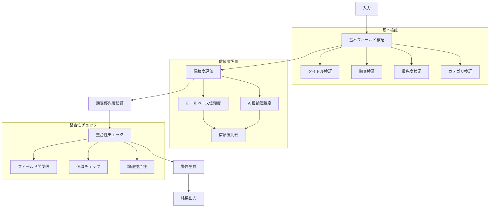

# Validator - 検証層モジュール

## 目次
1. [概要](#概要)
2. [主要機能](#主要機能)
3. [実装詳細](#実装詳細)
4. [処理フロー](#処理フロー)
5. [使用例](#使用例)

## 概要

検証層は、ルールベース解析とAI推論の結果を統合し、最終的な判断を行うモジュールである。Task.pyで定義された定数や判定ロジックを活用し、結果の信頼性と整合性を確保する。

### 特徴
- 複数の解析結果の統合
- 信頼度に基づく結果の選択
- 整合性チェックと警告生成
- 期限ベースの優先度調整

## 主要機能

### 1. 結果の検証と統合
- ルールベースとAI推論の結果を比較
- 信頼度の高い情報を優先的に採用
- 矛盾する情報の解決

### 2. 信頼度評価
- 各フィールドの信頼度計算
- 閾値に基づく結果の採用判定
- 複数の情報源からの総合的な評価

### 3. 整合性チェック
- フィールド間の関係性検証
- 期限と優先度の整合性確認
- データ型と値域のチェック

### 4. 警告生成
- 潜在的な問題の検出
- 改善提案の生成
- ユーザーへのフィードバック

## 実装詳細

### クラス構成

ResultValidatorクラスは、検証と統合の中核となるクラスである。Task.pyで定義された定数と判定ロジックを活用し、一貫性のある検証を実現する。

```python
class ResultValidator:
    def __init__(self):
        self.logger = logging.getLogger(__name__)
        self.priority_keywords = Task.PRIORITY_KEYWORDS
        self.category_keywords = Task.CATEGORY_KEYWORDS
        self.confidence_settings = Task.CONFIDENCE
        self.urgency_levels = Task.URGENCY_LEVELS
```

### 主要メソッド

#### 1. validate_results メソッド

このメソッドは、ResultValidatorの主要なエントリーポイントである。ルールベースとAI推論の結果を受け取り、検証と統合を行う。

```python
def validate_results(
    self,
    rule_based: Dict[str, Any],
    ai_result: Optional[Dict[str, Any]]
) -> Dict[str, Any]:
    """
    ルールベースとAI推論の結果を検証
    
    検証の流れ:
    1. 基本フィールドの検証
    2. 信頼度の高い情報を優先して選択
    3. 期限ベースの優先度調整
    4. 整合性チェックと警告生成
    """
```

#### 2. _validate_basic_fields メソッド

基本フィールドの検証を担当するメソッドである。必須フィールドの存在確認、データ型の検証、値域のチェックを行う。

```python
def _validate_basic_fields(
    self,
    rule_based: Dict[str, Any],
    ai_result: Optional[Dict[str, Any]]
) -> Dict[str, Any]:
    """
    基本フィールドの検証
    
    検証ステップ:
    1. タイトル（必須）の検証
    2. 期限のフォーマット検証
    3. 優先度の値域検証
    4. カテゴリの値域検証
    """
```

#### 3. _validate_deadline_priority メソッド

期限と優先度の整合性を検証し、必要に応じて優先度を調整するメソッドである。期限までの残り日数に基づいて適切な優先度を判断する。

```python
def _validate_deadline_priority(
    self,
    due_date: str,
    current_priority: str
) -> Dict[str, Any]:
    """
    期限に基づく優先度の検証と調整
    
    検証ロジック:
    1. 期限までの日数を計算
    2. Task.pyのurgency_levelsに基づいて優先度を判定
    3. 現在の優先度と推奨優先度を比較
    4. 必要に応じて警告を生成
    """
```

## 処理フロー

### 検証プロセス


## 使用例

### 基本的な使用方法

以下は、テキスト「来週の金曜日までに統計学のレポートを提出する必要がある」から生成された解析結果の検証例である。

```python
validator = ResultValidator()

# ルールベース解析の結果
rule_based_result = {
    "title": "統計学レポート提出",
    "due_date": "2024-11-22",  # 来週金曜日の日付（11月17日現在）
    "priority": "中",  # キーワードベースでは緊急性は低め
    "categories": ["統計学", "提出物"],
    "confidence": {
        "title": 0.8,
        "priority": 0.5,  # キーワードマッチの基本信頼度
        "category": 0.9
    }
}

# AI推論の結果
ai_result = {
    "title": "統計学課題",
    "priority": "高",  # 「必要がある」という表現から重要性を検出
    "categories": ["統計学", "データ分析"],  # 文脈から追加のカテゴリを推定
    "confidence": 0.8
}

# 結果の検証
validated_result = validator.validate_results(rule_based_result, ai_result)
```

### 期待される出力

```python
{
    "title": "統計学レポート提出",  # 高信頼度（0.8）のルールベース結果を採用
    "due_date": "2024-11-22",
    "priority": "高",  # AI推論の高信頼度（0.8）結果を採用
    "categories": ["統計学", "提出物", "データ分析"],  # 両方の結果を統合
    "warnings": [
        "ℹ️ AIモデルが高い優先度を示唆しています",
        "ℹ️ 複数のカテゴリが検出されました"
    ]
}
```

この例では以下の検証と調整が行われている。

1. タイトル：ルールベースの結果が高信頼度（0.8）のため採用
2. 期限：来週金曜日の日付を正しく検証
3. 優先度：
   - ルールベース：キーワードベースで「中」（信頼度0.5）
   - AI推論：文脈から「高」と判定（信頼度0.8）
   - 結果：より高信頼度のAI推論結果を採用
4. カテゴリ：
   - ルールベース：「統計学」「提出物」を検出
   - AI推論：「統計学」「データ分析」を推定
   - 結果：重複を除いて全てのカテゴリを統合
5. 警告：優先度の変更とカテゴリの統合について通知

### エラーハンドリング例

```python
try:
    # 無効な日付形式の例
    invalid_result = {
        "title": "テストタスク",
        "due_date": "2024/03/21",  # 不正な日付形式
        "priority": "最高",  # 無効な優先度
        "categories": ["存在しないカテゴリ"]
    }
    
    result = validator.validate_results(invalid_result, None)
    
except ValueError as e:
    # 期待されるエラーメッセージ:
    # - "期限は'YYYY-MM-DD'形式で指定してください"
    # - "優先度は '高'、'中'、'低' のいずれかを指定してください"
    # - "無効なカテゴリが指定されました"
    print(f"検証エラー: {str(e)}")
```