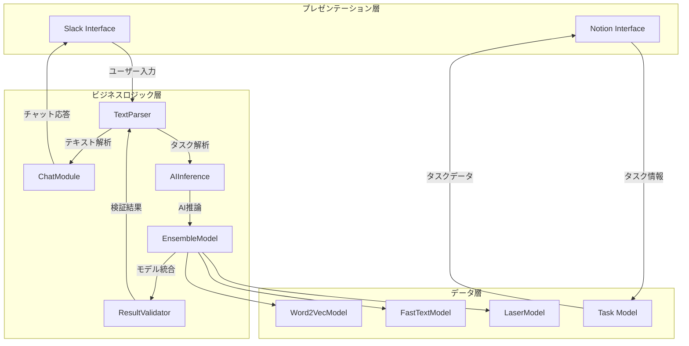
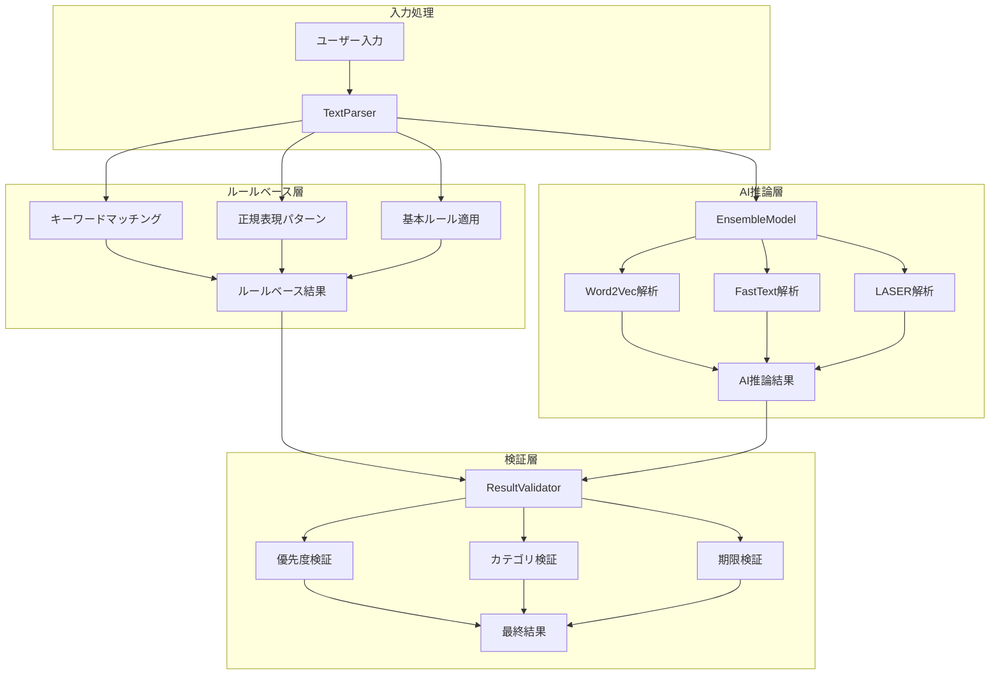
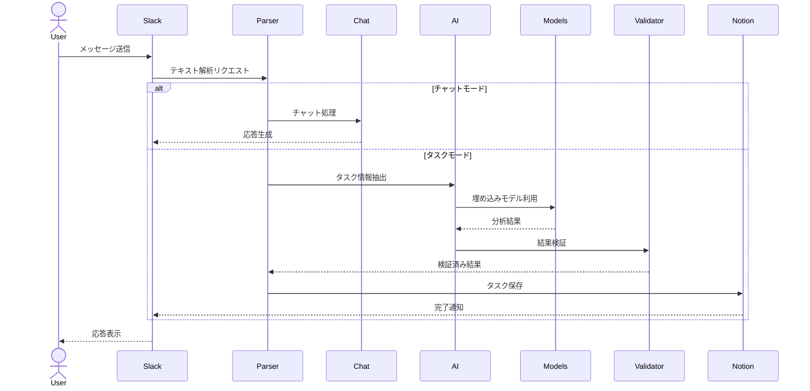

# Slack Bot タスク管理・対話システム

## 目次
1. [システム概要](#システム概要)
2. [アーキテクチャ](#アーキテクチャ)
3. [処理層の詳細](#処理層の詳細)
4. [機能仕様](#機能仕様)
5. [システム設定・評価基準](#システム設定・評価基準)
6. [主要コンポーネントの詳細](#主要コンポーネントの詳細)

## システム概要

本システムは、Slackを介してユーザーとの対話を行いながら、タスク管理とカジュアルな会話の両方に対応するチャットボットである。自然言語処理とAI技術を組み合わせ、3層アーキテクチャを採用している。

## アーキテクチャ

### システム構成図

#### プレゼンテーション層

- **Slack Interface**：ユーザーとBotの対話を管理する窓口
  - メッセージの送受信
  - コマンドの受付
  - 応答の表示

- **Notion Interface**：タスク情報の保存と表示を行う管理画面
  - タスクの記録
  - 一覧表示
  - タスク更新管理

#### ビジネスロジック層（処理層）

- **TextParser**：ユーザーの入力文を解析して意味を理解する部分
  - 例：「明日までに数学のレポートを提出」という文から
    - タスク：レポート提出
    - 期限：明日
    - カテゴリ：数学
    という情報を取り出す

- **ChatModule**：基本的な対話機能(授業指定)
  - キーワードに基づく応答
  - 感情分析による返答
  - 質問の生成

- **AIInference**：文章理解と推論
  - 文脈を考慮した意味理解
  - 優先度の推測
  - カテゴリの判定

- **EnsembleModel**：言語モデルの統合
  - 各モデルの結果を組み合わせ
  - 総合的な判断の実現

- **ResultValidator**：解析結果の検証と正規化
  - データの正確性確認
  - 結果の一貫性チェック
  - エラーの検出

#### データ層（基盤層）

- **埋め込みモデル群**
  - Word2Vec：単語の意味を理解するモデル
  - FastText：未知の単語も処理できるモデル
  - LASER：文章全体の意味を理解するモデル

- **タスクモデル（TaskModel）**：タスクの情報を定義し保存する仕組み
  - タスクの基本情報（タイトル、期限、優先度など）の定義
  - データの保存形式の指定
  - タスクの状態管理（未着手、進行中、完了など）

### 処理層フロー図

### シーケンス図

## 処理層の詳細

システムは3つの主要な処理層で構成され、各層が明確な役割を持っている。 

### 1. ルールベース層

#### 目的と役割
- 明示的な表現からの情報抽出
- 定型的なパターンの処理
- 基本的なタスク属性の特定

#### 主要機能
1. **キーワード処理**
   - 優先度を示す明示的な表現の認識（「急ぎ」「重要」など）
   - カテゴリを示す専門用語の識別（「数学」「プログラミング」など）
   - アクションワードの検出（「提出」「実装」等）

2. **日付・期限処理**
   - 明示的な日付表現の解析（「2024-03-20」など）
   - 相対的な期限表現の変換（「明日まで」「来週」など）
   - 時間的な緊急度の判定

3. **テキスト正規化**
   - 不要な表現の除去
   - 表記ゆれの統一
   - 文章構造の標準化

### 2. AI推論層

#### 目的と役割
- 暗示的な表現からの意図理解
- 文脈を考慮した総合的な判断
- 柔軟な解釈と推論

#### 主要機能
1. **意味理解**
   - 文脈に基づく優先度推定
   - 間接的な表現からのカテゴリ推定
   - 類似性に基づく情報補完

2. **文脈処理**
   - 前後の文脈を考慮した解釈
   - 複数の文章間の関係性理解
   - 暗示的な重要度の推定

3. **モデル統合**
   - 複数の言語モデルの組み合わせ
   - 各モデルの特性を活かした推論
   - 重み付けによる結果の統合

### 3. 検証層

#### 目的と役割
- 解析結果の信頼性評価
- 複数の結果の統合と検証
- 整合性の確保と補正
- 警告と推奨事項の生成

#### 主要機能
1. **結果検証**
   - 必須フィールドの確認
   - 日付形式の標準化
   - 値の範囲チェック
   - データ型の検証

2. **整合性チェック**
   - 期限と優先度の整合性
   - カテゴリ分類の妥当性
   - 複数フィールド間の関係検証

3. **信頼度評価**
   - ルールベースとAI推論の結果比較
   - 確信度に基づく結果の選択
   - 総合的な信頼度スコアの計算

4. **警告生成**
   - 潜在的な問題の検出
   - 改善提案の生成
   - ユーザーへのフィードバック

### 層間の連携

#### データフロー
1. **入力フェーズ**
   - ユーザー入力の受け取り
   - 前処理と正規化

2. **並列処理フェーズ**
   - ルールベース解析の実行
   - AI推論の実行

3. **統合フェーズ**
   - 結果の収集
   - 信頼度評価
   - 最終結果の決定

4. **出力フェーズ**
   - 検証済み結果の生成
   - 警告・推奨事項の付加
   - レスポンスの返却

## 機能仕様

### 1. タスク管理機能

#### 自然言語解析
- ユーザーの自然な表現からタスク情報を抽出
- 文脈を考慮した意図理解
- 暗示的な表現の解釈

#### 優先度管理
- キーワードベースの優先度判定
- 期限に基づく動的な優先度調整
- 文脈からの重要度推定
- 3段階の優先度（高・中・低）

#### カテゴリ分類
- 専門分野の自動判別
- 複数カテゴリの同時分類
- キーワードと文脈の組み合わせ判定

#### 期限管理
- 明示的な日付の解析
- 相対的な期限表現の解釈
- 期限切れの検知と警告
- 期限に基づく優先度の自動調整

#### Notion連携
- タスクの自動保存
- リアルタイムの更新
- ステータス管理
- 一元的なタスク管理

### 2. 対話機能（授業指定）

#### キーワード応答
- 定型表現の認識
- ユーザーの入力に応じた応答

#### 感情分析
- テキストのネガポジ判定
- 感情に応じた応答生成

#### 質問生成
- 名詞の抽出と質問形成

### 3. 判定システム

#### 優先度判定基準
- **高優先度**：緊急性・重要性が高いタスク
  - 明示的な緊急性（今すぐ、急ぎなど）
  - 期限切迫（今日中に、明日までなど）
  - 重要性を示す表現（必須、絶対など）

- **中優先度**：通常の進行タスク
  - 準備や確認が必要なタスク
  - 近い将来の期限（来週までなど）

- **低優先度**：余裕のあるタスク
  - 明示的な余裕（ゆっくり、後でなど）
  - 遠い期限（来月までなど）

#### カテゴリ分類基準
- **学術関連**
  - 数学：「計算」・「数式」など
  - 統計学：「データ分析」・「前処理」など
  - 機械学習：「AI」・「ニューラルネットワーク」など
  - 研究：「論文」・「実験」など

- **業務関連**
  - 開発：「実装」・「開発」・「プログラミング」など
  - インターン：「業務」・「報告」など
  - ミーティング：「打ち合わせ」・「相談」など
  - 提出物：「課題」・「レポート」など

## システム設定・評価基準

### データモデル
- タイトル（必須）：タスクの主要識別子
- 期限（オプション）：完了期限
- 優先度：タスクの重要度
- カテゴリ：分類タグ
- ステータス：進行状態

### 信頼度評価
- 基本信頼度：0.5（初期値）
- 増分：0.1（キーワードマッチごとに上昇する信頼度）
- 最大値：1.0（完全なマッチ）
- 閾値：0.3（AI判定で有効とみなす最低ライン）

### モデル重み付け
- LASER：0.5
- Word2Vec：0.3
- FastText：0.2

## 主要コンポーネントの詳細

本システムを構成する主要なコンポーネントの詳細な説明は、以下のリンク先を参照。

- [TextParser](components/text_parser.md)：自然言語解析とタスク情報の抽出
  - テキストの前処理
  - ルールベース解析
  - タスク情報の構造化

- [Validator](components/validator.md)：結果の検証と統合
  - ルールベースとAI推論の結果検証
  - 信頼度評価
  - 整合性チェック

- [EnsembleModel](components/ensemble.md)：複数のAIモデルの統合
  - Word2Vec、FastText、LASERモデルの統合
  - 重み付け推論
  - 類似度計算

- [AIInference](components/inference.md)：AI推論の実行
  - テキスト分析
  - カテゴリ推定
  - 優先度判定

- [Embeddings](components/embeddings.md)：埋め込みモデル群
  - Word2Vecモデル
  - FastTextモデル
  - LASERモデル

- [SlackService](components/slack_service.md)：Slackとの連携
  - メッセージ処理
  - コマンド解析
  - 応答生成

- [NotionService](components/notion_service.md)：Notionとの連携
  - タスクの永続化
  - データベース管理
  - タスク更新

- [TaskModel](components/task.md)：タスクデータモデル
  - タスク属性の定義
  - バリデーション
  - ステータス管理

- [Main](components/main.md)：システムエントリーポイント
  - サービスの初期化
  - 実行フロー
  - エラーハンドリング